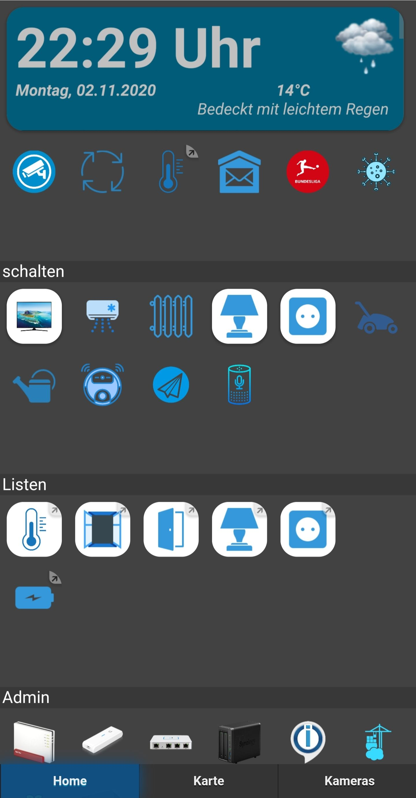
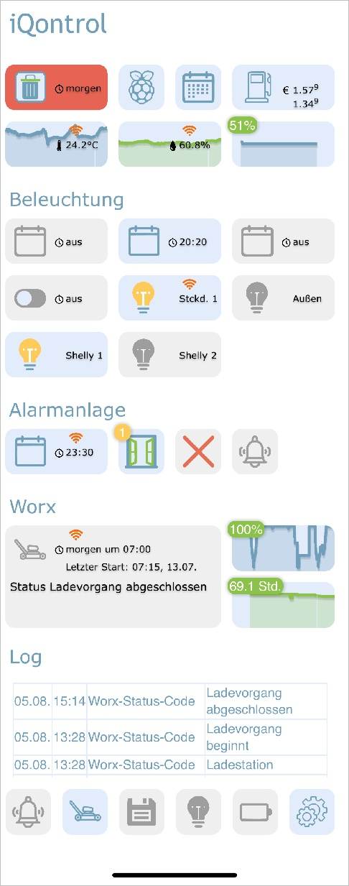
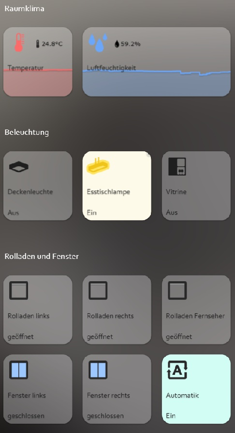
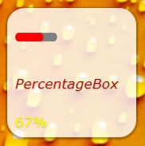
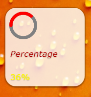
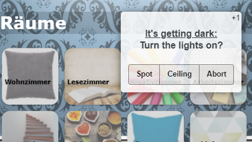
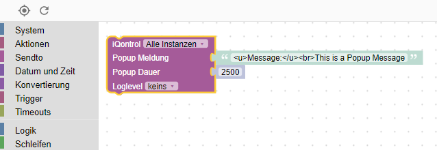
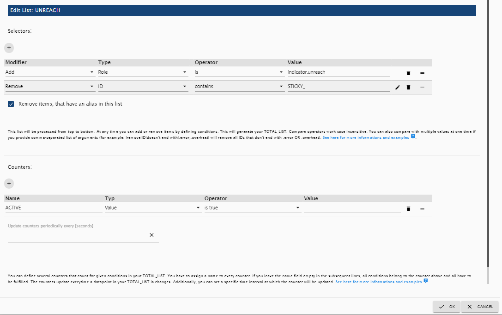
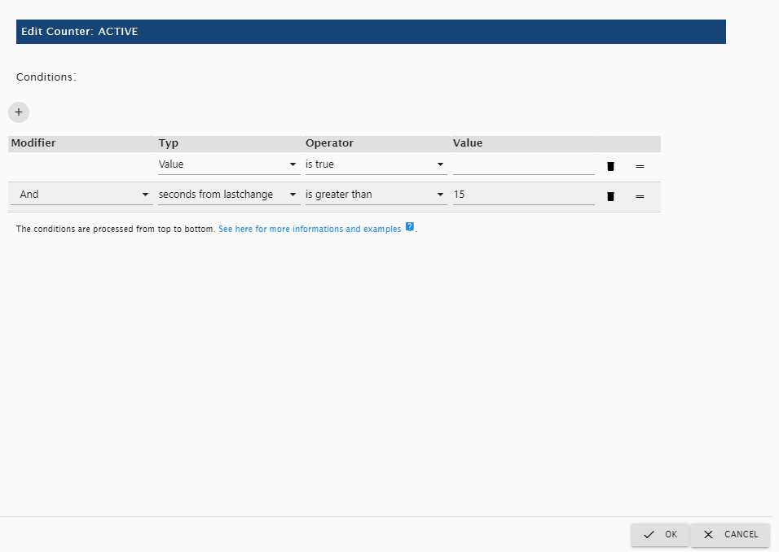

# ioBroker.iqontrol

 
 
[](https://www.npmjs.com/package/iobroker.iqontrol)
[](https://www.npmjs.com/package/iobroker.iqontrol)
[](https://snyk.io/test/github/sbormann/ioBroker.iqontrol)
<!-- [](https://weblate.iobroker.net/engage/adapters/?utm_source=widget) -->


[](https://nodei.co/npm/iobroker.iqontrol/)

**Tests:**

| Linux/Mac/Windows:                                                                                                                    | Cross-Browser-Checking: |
|---------------------------------------------------------------------------------------------------------------------------------------| --- |
| [](https://travis-ci.org/sbormann/ioBroker.iqontrol) | [](https://www.browserstack.com) |


****

## iQontrol adapter for ioBroker

Fast Web-App for Visualization. 


&copy; by dslraser: 



&copy; by muuulle:



&copy; by peks-64:




Runs in any Browser. 
Easy to set up, although it's fully customizable and responsive.

> **This adapter uses Sentry libraries to automatically report exceptions and code errors to the developers.** For more details and for information how to disable the error reporting see [Sentry-Plugin Documentation](https://github.com/ioBroker/plugin-sentry#plugin-sentry)! Sentry reporting is used starting with js-controller 3.0.

## Credits

This adapter would not have been possible without the great work of @o0Shojo0o (https://github.com/o0Shojo0o), who developed former releases of this adapter.

## How to report issues and feature requests

Ideally, please use GitHub issues for this, with the best method achieved by setting the adapter to Debug log mode (Instances -> Expert mode -> Column Log level). Then retrieve the logfile from disk via the  'log' ioBroker subdirectory, **not** from Admin, which will cut lines. 

## Video-Tutorial (German Language):
[](https://youtube.com/playlist?list=PL8epyNz8pGEv6-R8dnfXm-m5aBlZFKOBG)


## Add to Homescreen
You can save it as Web-App on Homescreen, and it looks and feels like a native app:


This also works on your PC with Chrome:
* Open iQontrol in Chrome
* Klick on the three-dots-menu - More tools - Create shortcut
* You will then find iQontrol in the start menu under chrome apps and can even add it to your taskbar

## You need...
* Nodejs 10 or higher
* Web-Adapter with one instance running the same protocol (http or https) as the admin-adapter, socket.IO set to 'integrated' and 'Force Web-Sockets' disabled
    * If this stands in conflict to other adapters, simply add another instance with the above settings - iQontrol will search the best fitting web-adapter-instance and use it for communication
	* For connecting over *iobroker.pro-Cloud* both, admin- and web-adapter should be set to http (not https)

* If you experience any problems, please have a look at the [troubleshooting](#troubleshooting) section at the end of this readme


## Forum
Visit the Support-Thread [iobroker forum](https://forum.iobroker.net/topic/52077). 
Visit the Developer-Thread [iobroker forum](https://forum.iobroker.net/topic/22039). 


## Wiki
Have a look at the wiki [wiki](https://github.com/sbormann/ioBroker.iqontrol/wiki).


## How to use
**Don't be scared of the many options you have.**
Most things work right out of the box. You *can*, but you don't have to use all the configuration-possibilities iQontrol offers! Just start this way:
* Start creating views.
	You can consider views as something like a page.
* Then create devices on these views.
	Devices have a role, that determines the function of the device, which icons are used and so on.
	Depending on that role you can link several states to the device. These will give the device its functionality.
	If you select 'Link to other view' as role you can create links to other views. I suggest skinning Links to other views with the same Background, the linked view has.
	You can also try to use the Auto-create-Function to choose an existing device from the iobroker-object-tree. Auto-create tries to find out the role and to match as many states as possible.
* Afterwards you can create a toolbar, which is displayed as footer.
	Toolbar-Entries are links to views.
	The first Toolbar-Entry will be your 'Home-View' with will be loaded at start.
* To give everything a fancy style, you can upload your own images.
	You can use your images as background-images for views, or for devices.
	Images in the folder `/usericons` can be used as icons for devices.
	The free builtin demo-wallpapers are from www.pexels.com.

### Use Auto-create
* You'll find a `Autocreate Views`-Button inside the  `Views`-Tab
* If you have well maintained ioBroker enumerations like Rooms or Functions, you can use this function to automatically build Views with the devices listed inside this enumerations
* Keep in mind, because of the large numbers of different adapters and devices inside the ioBroker-universe, the auto-creation feature can not maintain all devices 100% correctly. You may need to rework some settings by hand to get the best results. But auto-create offers you a good starting point to build your own visualization in seconds. 


## URL-Parameters
* The frontend is called via `http[s]://<url or ip of iobroker>:<port of web adapter>/iqontrol/index.html`
    * `<port of web adapter>` is usually 8082
* To open a specified instance you can add `namespace=iqontrol.<instance-number>` as URL-parameter
* To open a specified view you can add `renderView=<viewID>` as URL-parameter.
    * `<viewID>` needs to be formatted like `iqontrol.<instance-number>.Views.<view-name>`
	* Note: this is case-sensitive!
* To open a specified view as homepage you can add `home=<viewID>` as URL-parameter. This will also change the linked view of the first toolbar entry!
    * `<viewID>` needs to be formatted like `iqontrol.<instance-number>.Views.<view-name>`
	* Note: this is case-sensitive!
* To open a specified dialog while loading the page you can add `openDialog=<deviceID>` as URL-parameter
    * `<deviceID>` needs to be formatted like `iqontrol.<instance-number>.Views.<view-name>.devices.<device-number>` where `<device-number>` starts from 0 (so the first device on a view is device number 0)
	* Note: this is case-sensitive!
* To set or override return after time settings, use the following parameters:
    * `returnAfterTimeTreshold=<time in seconds>` to set the time, after which the destination view is called. Use `0` to disable return after time feature.
	* `returnAfterTimeDestiationView=<viewID>` to set the view, which is called after the threshold. If not specified, the home view will be used.
	* These options are helpful, if you call iQontrol from a wall mounted tablet, which should automatically return to home-view after being used 
* To load the page without toolbar you can add `noToolbar=true`
* To load the page without panel you can add `noPanel=true`
* To load the page without toolbar and panel, swiping deactivated, no loading-spinner and with transparent loading-screen you can add `isBackgroundView=true`
* Normally iQontrol uses the language that is set in ioBroker. You can overwrite that by adding `language=<xx>`
	* `<xx>` can be `de`, `en`, `es`, `fr`, `it`, `nl`, `pl`, `pt`, `ru` or `zh-cn` 
* If your iQontrol instance is password protected by a passphrase (see Options - Passphrase-Protection), you can submit the passphrase by adding `passphrase=<MyPassphrase>' 

**Example:**
* `https://192.168.1.1:8082/iqontrol/index.html?namespace=iqontrol.1&home=iqontrol.1.Views.Living-Room`
    * Note upper and lower case


## Fonts
* You can upload your own font files in the Images/Widgets-Tab into the folder `/userfonts`
* In the Options-Tab you have several places where these fonts can be chosen
* It depends on your servers MIME-Settings, if the font is presented correctly to the browser - for me best worked .ttf and .woff (tested on a raspi 4b)
    * These mime-settings should work:
	    * .otf: `application/x-font-opentype`
		* .ttf: `application/x-font-ttf` or `application/x-font-truetype`
		* .woff: `application/font-woff`
		* .woff2: `application/font-woff2`
		* .eot: `application/vnd.ms-fontobject`
	* You can convert fonts to other formats on `fontsquirrel.com` under generator
* Keep in mind - webfonts are always a little tricky and not every font with every server and every browser will work

## Icons and Background-Images
* You can use the inbuilt images or the images uploaded under the images tab or any free url you like
* You can also use a variable inside the image-url. This may be useful for example for weather-forecasts. Use this pattern:
    * `path/to/firstloaded.png|anotherpath/to/{iobrokerstate|fallback}.png`
    * Example: `./../iqontrol.meta/userimages/demo/bottle.jpg|./../iqontrol.meta/userimages/demo/{javascript.0.myimage|whitestone}.jpg` 
	* This loads `./../iqontrol.meta/userimages/demo/bottle.jpg` when you open the view
	* As soon as the state of `javascript.0.myimage` is fetched from the server, the image will be replaced with `./../iqontrol.meta/userimages/demo/XXX.jpg` where `XXX` is the value of `javascript.0.myimage`
	* If `javascript.0.myimage` has no value the fallback `whitestone` will be used (using the fallback is optional)

### Progress Bars
* It is possible, to use SVG-Definitions in combination with variables instead of imagefiles to display progress-bars
* There are a vew templates integrated to chose from, but you can also create your own SVGs




* See [Wiki](https://github.com/sbormann/ioBroker.iqontrol/wiki/Progress-Bars) for further information

### Charts
* You can add the ''FLOT Chart-Widget'' as BACKGROUND_URL of any device, which will automatically display the main state as a chart in the background of the device-tile
* You need to ensure that the state is logged and recorded by one of the history-adapters of ioBroker


## Device-Names
* Just like variables in image-urls you can use variables in device-names. The syntax is almost the same:
    * `Text while loading|Text after loading {iobrokerstate|fallback}`
	* Additionally, can put the iobroker state into square brackets, then the plain value without its unit will be used: `Text while loading|Text after loading {[iobrokerstate]|fallback}`
    * Example: `Weather is loading|Weather: {javascript.0.weather|No weather data found}` 
	* This shows `Weather is loading` when you open the view
	* As soon as the state of `javascript.0.weather` is fetched from the server, the text will be replaced by `Weather: XXX` where `XXX` is the value of `javascript.0.weather`
	* If `javascript.0.weather` has no value the fallback `No weather data found` will be used (using the fallback is optional)


## Popup-Messages
* Every instance creates the state `iqontrol.x.Popup.Message`
	* When passing values to this state, a popup-message (or toast) will be displayed on all **currently** opened iQontrol frontends
* Additionally every instance creates the state `iqontrol.x.Popup.PersistentMessage`
	* When passing values this state, the popup-message will be saved into the PERSISTENT_MESSAGES_PENDING-Array. 
	* Persistent messages will not be only displayed on all currently opened iQontrol frontends, but also on all **in future** opened instances until they are confimed (by click or duration) or they expire.
	* `PersistentExpires` defines, when the persistent message expires as a UNIX-Timestamp (seconds from 1970-01-01 00:00:00). Values lower than 31536000 are interpreted as a duration in seconds from now (31536000 seconds = 1 year).
	* `PersistentUndismissible` *boolean* - If this is set to true, the persistent message will be kept even after it is closed. If you open a new iQontrol instance, it will be displayed again. Otherwise persistent messages are deleted after the popup closes (even by click or when the duration has elapsed).
	* `PersistentId` is an optional arbitrary expression that can be used to identify the message.
		* The id can be used to delete corresponding popup messages by sending the id to `PERSISTENT_MESSAGES_DELETE_ID`. Sending `null` to this datapoint removes all pending messages.
		* The id can also be used to display corresponding popup messages on all currently opened iQontrol-Instances again by sending the id to `PERSISTENT_MESSAGES_SHOW_ID`. Sending `null` to this datapoint shows all pending messages.
	* **Note**: You can send a message to only one of the two data points "Message" or "PersistentMessage", not to both.
* You can use html-tags to format the message text
* There are some additional states for further customization of the displayed popup (these must be set, before the message datapoint is set):
    * `Duration`: This is the time in ms the message is displayed; if set to 0 the message has to be confirmed
    * `ClickedValue` and `ClickedDestinationState`: If the popup is clicked by user, the value from `ClickedValue` will be sent to `iqontrol.x.Popup.POPUP_CLICKED` and, if specified, additional to the datapoint in `ClickedDestinationState` 
        * If no value is specified, `true` will be used
	* `ClickKeepsOpen` *boolean* - if true, the popup can only be closed by clicking on a button, klicking the popup itself will not close it. So make shure you add buttons to your popup-message, as described beneath.
    * `ButtonNames`: Here you can specify a comma separated list of buttons, that will be displayed at the bottom of the popup (for example "OK,Abort")
        * `ButtonValues` and `ButtonDestinationStates`: These are comma separated lists of values that will be sent to `iqontrol.x.Popup.BUTTON_CLICKED` and, if specified, additional to the datapoint in `ButtonDestinationStates`, if the user clickes the corresponding button
		    * Instead of a datapoint you can use the commands `COMMAND:renderView` and `COMMAND:openDialog` as a ButtonDestinationState, to render a view or open a dialog
			* The ButtonValue then specifies the view resp. dialog and needs to be in the format `iqontrol.<instance-number>.Views.<view-name>` resp. `iqontrol.<instance-number>.Views.<view-name>.devices.<device-number>` where `<device-number>` starts from 0 (so the first device on a view is device number 0)
		* If you only use one value (instead of a comma separated list), this value will be used for all buttons
		* If you leave `ButtonValues` empty, the name of the button will be used
		* If you only use one destination state (instead of a comma separated list), this state will be used for all buttons
        * `ButtonCloses`: This is a comma separated list of booleans (`true`/`false`) that specify, if the popup should be closed, when the corresponding button is pressed
        * `ButtonClears`: This is a comma separated list of booleans (`true`/`false`) that specify, if the popup settings should be cleared (= set all popup-states to empty), when the corresponding button is pressed
* Alternatively you can set these values via sendTo-command with the parameters `PopupMessage`, `PopupDuration`, `PopupClickedValue` and so on
    * Example: `sendTo("iqontrol", "send", {PopupMessage: 'This is my message', PopupDuration: 2500, PopupClickedValue: 'messageConfirmed'});`
* You can also use blockly to send messages to iQontrol





## Widgets
* Every tile has a BACKGROUND_URL and a BACKGROUND_HTML datapoint
* Here you can define a link (via BACKGROUND_URL) to a website or place direct HTML-Code (via BACKGROUND_HTML), that will be displayed as background of the tile
* This gives you the possibility to place (interactive) content inside a tile (like clocks, FLOT-charts, tables, weather-forecasts and so on)
* By default, mouse events will be directed to this content (thus you can't click the tile itself anymore), but you can disable this with the option "Direct mouse events to the tile instead to the content of BACKGROUND_VIEW/URL/HTML"
* iQontrol offers a device-role "Widget" which has some predefined options set that will be mostly used when showing a website as widget. But you can achieve the same result with any other role by modifying the devices options properly.


<details>
<summary>Widget development (for experts only): (<ins>klick to open</ins>)</summary>

### jQuery
* Technically the content of BACKGROUND_VIEW/URL/HTML is placed inside a HTML-Element called iframe, which is a website inside a website
* In order to use jQuery, you can transfer it from iQontrol to the iFrame with the following code: 
    ``window.$=window.jQuery=parent.jQuery.extend(function(s){return parent.jQuery(s,document)},parent.jQuery);``
* Example:
	```html
	<!doctype html>
	<html>
	<head>
		<meta http-equiv="Content-Type" content="text/html; charset=UTF-8"/>
		<meta name="widget-description" content="This is a demo widget-preset. It has no useful funcion. (C) by Sebastian Bormann"/> 
		<meta name="widget-options" content="{'noZoomOnHover': 'true', 'hideDeviceName': 'true', 'sizeInactive': 'xwideIfInactive highIfInactive', 'iconNoPointerEventsInactive': 'true', 'hideDeviceNameIfInactive': 'true', 'hideStateIfInactive': 'true', 'sizeActive': 'fullWidthIfActive fullHeightIfActive', 'bigIconActive': 'true', 'iconNoPointerEventsActive': 'true', 'hideDeviceNameIfActive': 'true', 'hideStateIfActive': 'true', 'sizeEnlarged': 'fullWidthIfEnlarged fullHeightIfEnlarged', 'bigIconEnlarged': 'true', 'iconNoPointerEventsEnlarged': 'false', 'noOverlayEnlarged': 'true', 'hideDeviceNameIfEnlarged': 'true', 'hideStateIfEnlarged': 'true', 'popupAllowPostMessage': 'true', 'backgroundURLAllowPostMessage': 'true', 'backgroundURLNoPointerEvents': 'false'}"/>
		<title>iQontrol Widget Test</title>
	</head>
	<body>
		<div id="testDiv">Loading...</div>
		<script type="text/javascript">
			console.log("JQUERY-TEST");
			window.$=window.jQuery=parent.jQuery.extend(function(s){return parent.jQuery(s,document)},parent.jQuery);
			$(document).ready(function(){
				$('#testDiv').html("<h1>Hello World</h1)");
				console.log("jQuery works!!");
			});
		</script>	
	</body>
	</html>
	```

### postMessage-Communication
* By enabling the option "Allow postMessage-Communication for BACKGROUND_VIEW/URL/HTML" you can enable postMessage-Communication between the widget in its iframe and iQontrol itself
* To send commands to iQontrol you can use the following javascript-command: `window.parent.postMessage(message, "*");` 
    * `message` is a javascript object of the format `{ command: command, stateId: stateId, value: value }`
    * The following message-commands are supported:
        * `{ command: "setWidgetState", stateId: <widgetStateId>, value: <value> }`
			* This will set the ioBroker state `iqontrol.<instance>.Widgets.<widgetStateId>` to the value `<value>` (`<value>` can be a string, number or boolean or an object like `{ val: <value>, ack: true|false }`)
        * `{ command: "getWidgetState", stateId: <widgetStateId> }`
			* This will cause iQontrol to send the value of the ioBroker state `iqontrol.<instance>.Widgets.<widgetStateId>` (see below how to receive the answer-message)
        * `{ command: "getWidgetStateSubscribed", stateId: <widgetStateId> }`
			* This will cause iQontrol to send the value of the ioBroker state `iqontrol.<instance>.Widgets.<widgetStateId>` now and every time its value changes (see below how to receive the answer-messages)
        * `{ command: "setWidgetDeviceState", stateId: <widgetDeviceState>, value: <value> }`
			* This will set the ioBroker datapoint that is assigned to the devices STATE `<widgetDeviceState>` (for example the datapoint, that is assigned to LEVEL) to the value `<value>` (`<value>` can be a string, number or boolean or an object like `{ val: <value>, ack: true|false }`)
        * `{ command: "getWidgetDeviceState", stateId: <widgetDeviceState> }`
			* This will cause iQontrol to send the value of the ioBroker datapoint, that is assigned to the devices STATE `<widgetDeviceState>` (for example the datapoint, that is assigned to LEVEL; see below how to receive the answer-message)
        * `{ command: "getWidgetDeviceStateSubscribed", stateId: <widgetDeviceState> }`
			* This will cause iQontrol to send the value of the ioBroker datapoint, that is assigned to the devices STATE `<widgetDeviceState>` (for example the datapoint, that is assigned to LEVEL) now and every time its value changes (see below how to receive the answer-message)
        * `{ command: "setState", stateId: <stateId>, value: <value> }`
			* This will set the ioBroker state `<stateId>` to the value `<value>` (`<value>` can be a string, number or boolean or an object like `{ val: <value>, ack: true|false }`)
        * `{ command: "getState", stateId: <stateId> }`
			* This will cause iQontrol to send the value of the ioBroker state `<stateId>` (see below how to receive the answer-message)
        * `{ command: "getStateSubscribed", stateId: <stateId> }`
			* This will cause iQontrol to send the value of the ioBroker state `<stateId>` now and every time its value changes (see below how to receive the answer-messages)
        * `{ command: "getOptions"}`
			* This will cause iQontrol to send the user options the user has configured as object
        * `{ command: "renderView", value: <viewID> }`
			* This will instruct iQontrol to render a view, where `<viewID>` needs to be formatted like `iqontrol.<instance-number>.Views.<view-name>` (case-sensitive)
        * `{ command: "openDialog", value: <deviceID> }`
			* This will instruct iQontrol to open a dialog, where `<deviceID>` needs to be formatted like `iqontrol.<instance-number>.Views.<view-name>.devices.<device-number>` where `<device-number>` starts from 0 (so the first device on a view is device number 0)
* To receive messages from iQontrol, you need to register an event-listener to the "message"-event with the javascript-command `window.addEventListener("message", receivePostMessage, false);`
    * The function `receivePostMessage` receives the object `event`
	* `event.data` contains the message from iqontrol, which will be an object like:
	    * event.data = `{ command: "getState", stateId: <stateId>, value: <stateObject> }` - this will be the answer to a `getState`-command or a `getStateSubscribed`-command and gives you the actual `<value>`-object of the ioBroker state`<stateId>`
		* `<stateObject>` itself is an object like 
			```
			event.data.value = {
				val: <value (rounded)>,
				unit: "<unit>",
				valFull: <value (not rounded, no javascript-injection prevention)>,
				plainText: "<clear text of val, for example taken from valuelist>",
				min: <minimum>,
				max: <maximum>,
				step: <step-width>,
				valuelist: {<object with possible values and corresponding clear text>},
				targetValues: {<target value list>},
				ack: <true|false>,
				readonly: <true|false>,
				custom: {<object with custom settings>},
				id: <id of the iobroker datapoint>,
				from: "<source of state>",
				lc: <timestamp of last change>,
				ts: <timestamp of last actualization>,
				q: <quality of signal>,
				role: "<role of state>",
				type: "<string|number|boolean>",
				name: "<name of datapoint>",
				desc: "<description of datapoint>",
				Date: <Date-object (only present, if value is regognized as a valid time or period)>
			}
			```
* To instruct iQontrol to generate a widgetState under `iqontrol.<instance>.Widgets` you can use a meta-tag inside the head-section of the widget-website:
    * Syntax: 
      ```
      <meta name="widget-datapoint" content="WidgetName.StateName" data-type="string" data-role="text" />
      ```
    * You can further configure the datapoint by using data-type (which can be set to string, number or boolean), data-role, data-name, data-min, data-max, data-def and data-unit attributes
    * You can also use a URL-parameter (see below) as a variable, for example to create distinct instances of the widgets with own data points.
        * The Syntax is then:
		  ```
          <meta name="widget-datapoint" content="WidgetName.StateName|WidgetName.{instance}.StateName" data-type="string" data-role="text" />
          ```
        * If the variable `instance` is set, then the part after the `|` will be used as widgetState-Name and `{instance}` will be replaced by the value of `instance`
        * If the variable `instance` is not set, then the part before the `|` will be used as `wigdetState`-Name
    * The corresponding datapoint is only then created, if the widget-website is added to a device as URL or BACKGROUND_URL	
* The same concept may be used for the URL/HTML-State, which is used to display a website inside the dialog of a device
* To create an icon for your widget place a .png file with the same filename as the widget into the widgets directory
* See below for an example widget-website:

<details>
<summary>Show example widget-website to be displayed as widget with postMessage-communication: (<ins>klick to open</ins>)</summary>

* You can use the following HTML code and copy it to the BACKGROUND_HTML-State of a widget (which then needs to be configured as "Constant") 
* As an alternative you can upload this code as html-file into the `/userwidgets` subdirectory and reference it to BACKGROUND_URL-State (which then also needs to be configured as "Constant")
* Activate the option "Allow postMessage-Communication for BACKGROUND_VIEW/URL/HTML"
* It will demonstrate how a two-way communication between the website and iQontrol is done
```html
<!doctype html>
<html>
<head>
	<meta http-equiv="Content-Type" content="text/html; charset=UTF-8"/>
	<meta name="widget-datapoint" content="postMessageTest.test" data-type="string" data-role="text" />
	<meta name="widget-description" content="This is a test widget. To get the WidgetDeviceState-Functions working, please set a valid iobroker-datapoint for STATE. (C) by Sebastian Bormann"/> 
	<meta name="widget-urlparameters" content="title/postMessageTest/Please enter a title">
	<meta name="widget-options" content="{'noZoomOnHover': 'true', 'hideDeviceName': 'true', 'sizeInactive': 'xwideIfInactive highIfInactive', 'iconNoPointerEventsInactive': 'true', 'hideDeviceNameIfInactive': 'true', 'hideStateIfInactive': 'true', 'sizeActive': 'xwideIfActive highIfActive', 'bigIconActive': 'true', 'iconNoPointerEventsActive': 'true', 'hideDeviceNameIfActive': 'true', 'hideStateIfActive': 'true', 'sizeEnlarged': 'fullWidthIfEnlarged fullHeightIfEnlarged', 'bigIconEnlarged': 'true', 'iconNoPointerEventsEnlarged': 'false', 'noOverlayEnlarged': 'true', 'hideDeviceNameIfEnlarged': 'true', 'hideStateIfEnlarged': 'true', 'popupAllowPostMessage': 'true', 'backgroundURLAllowPostMessage': 'true', 'backgroundURLNoPointerEvents': 'false'}"/>
 	<title>iQontrol postMessageTest</title>
</head>
<body>
	<br><br>
	<h3><span id="title">postMessageTest</span><h3>
	<button onclick="getWidgetState('postMessageTest.test')">getWidgetState postMessageTest.test</button><br>
	<button onclick="getWidgetStateSubscribed('postMessageTest.test')">getWidgetStateSubscribed postMessageTest.test</button><br>
	<button onclick="setWidgetState('postMessageTest.test', 'Hello world')">setWidgetState postMessageTest.test to 'Hello world'</button><br>
  	<br>
	<button onclick="getWidgetDeviceState('STATE')">getWidgetDeviceState STATE</button><br>
	<button onclick="getWidgetDeviceStateSubscribed('STATE')">getWidgetDeviceStateSubscribed STATE</button><br>
	<button onclick="setWidgetDeviceState('STATE', 'Hello world')">setWidgetDeviceState STATE to 'Hello world'</button><br>
  	<br>
	<button onclick="getState('system.adapter.admin.0.cpu')">getState system.adapter.admin.0.cpu</button><br>
	<button onclick="getStateSubscribed('system.adapter.admin.0.uptime')">getStateSubscribed system.adapter.admin.0.uptime</button><br>
	<button onclick="setState('iqontrol.0.Popup.Message', 'Hey, this is a test Message')">setState popup message</button><br>
  	<br>
	<button onclick="renderView('iqontrol.0.Views.Home')">renderView 'Home'</button><br>
	<button onclick="openDialog('iqontrol.0.Views.Home.devices.0')">openDialog 1st device on 'Home'</button><br>
	<br><hr>
	message sent: <span id="messageSent">-</span><br>
	<br><hr>
	message received: <span id="messageReceived">-</span><br>
	<br><hr>
	this means: <span id="thisMeans">-</span><br>
	<br><hr>
    <script type="text/javascript">
		var countSend = 0;
		var countReceived = 0;
		
		//Set title from UrlParameter
		document.getElementById('title').innerHTML = getUrlParameter('title') || "No Title set";
			
		//getWidgetState
		function getWidgetState(stateId){
			sendPostMessage("getWidgetState", stateId);
		}
      
		//getWidgetStateSubscribed (this means, everytime the state changes, an update will be received)
		function getWidgetStateSubscribed(stateId){
			sendPostMessage("getWidgetStateSubscribed", stateId);
		}
		
		//setWidgetState
		function setWidgetState(stateId, value){
			sendPostMessage("setWidgetState", stateId, value);
		}

		
		//getWidgetDeviceState
		function getWidgetDeviceState(stateId){
			sendPostMessage("getWidgetDeviceState", stateId);
		}
      
		//getWidgetDeviceStateSubscribed (this means, everytime the state changes, an update will be received)
		function getWidgetDeviceStateSubscribed(stateId){
			sendPostMessage("getWidgetDeviceStateSubscribed", stateId);
		}
		
		//setWidgetDeviceState
		function setWidgetDeviceState(stateId, value){
			sendPostMessage("setWidgetDeviceState", stateId, value);
		}
      
		
		//getState
		function getState(stateId){
			sendPostMessage("getState", stateId);
		}

		//getStateSubscribed (this means, everytime the state changes, an update will be received)
		function getStateSubscribed(stateId){
			sendPostMessage("getStateSubscribed", stateId);
		}
		
		//setState
		function setState(stateId, value){
			sendPostMessage("setState", stateId, value);
		}
      

		//renderView
		function renderView(viewId){
			sendPostMessage("renderView", null, viewId);
		}

		//openDialog
		function openDialog(deviceId){
			sendPostMessage("openDialog", null, deviceId);
		}
		
		// +++++ Default Functions +++++		
		//getUrlParameter
		function getUrlParameter(name) {
			name = name.replace(/[\[]/, '\\[').replace(/[\]]/, '\\]');
			var regex = new RegExp('[\\?&]' + name + '=([^&#]*)');
			var results = regex.exec(location.search);
			return results === null ? null : decodeURIComponent(results[1].replace(/\+/g, ' '));
		};
      
		//send postMessages
		function sendPostMessage(command, stateId, value){
			countSend++;
			message = { command: command, stateId: stateId, value: value };
			document.getElementById('messageSent').innerHTML = countSend + " - " + JSON.stringify(message);
			window.parent.postMessage(message, "*");
		}

		//receive postMessages
		window.addEventListener("message", receivePostMessage, false);
		function receivePostMessage(event) { //event = {data: message data, origin: URL of origin, source: id of sending element}
			countReceived++;
			if(event.data) document.getElementById('messageReceived').innerHTML = countReceived + " - " + JSON.stringify(event.data);
			if(event.data && event.data.command) switch(event.data.command){
				case "getState":
				if(event.data.stateId && event.data.value && event.data.value.val){
					document.getElementById('thisMeans').innerHTML = "Got State " + event.data.stateId + " with value " + event.data.value.val;
				}
				break;
			}
		}	
	</script>
</body>
</html>
```
</details>

### Further configuration of widgets
* There are additional meta-tags, you can use inside the head-section of your widget-website to configure the behavior of the widget:
	* `widget-description`
		* syntax: 
		  ```  
          <meta name="widget-description" content="Please see www.mywebsite.com for further informations. (C) by me"/>
          ```
		* The content will be displayed when choosing the widget as URL or BACKGROUND_URL or if you auto-create a widget
	* `widget-urlparameters`
		* syntax: 
		  ```
          <meta name="widget-urlparameters" content="parameter/default value/description/type;parameter2/default value2/description2/type2"/>
          ```
 		* The user will be asked for these parameters when choosing the widget as URL or BACKGROUND_URL or auto-creates a widget
		* `type` is optional and may be `text` (this is default), `number`, `checkbox`, `color`, `select`, `multipleSelect`, `combobox`, `historyInstance`, `datapoint`, `listJsonDatapoint`, `icon`, `fontFamily`, `fontSize`, `fontStyle`, `fontWeight`, `language`, `section`, `divider`, `info`, `link` or `hidden`
		    * If type is `select`, `multipleSelect` or `combobox` then you need to specify the possible options by adding `/<selectOptions>`, where `<selectOptions>` is a string of the format `<value1>,<caption1>/<value2>,<caption2>/...` (combobox is a selectbox with the possibility to enter free text)
		    * If type is `number` then can specify min, max and step-width by adding `/<numberOptions>`, where `<numberOptions>` is a string of the format `<min>,<max>,<step>`
			* The types `section`, `divider`, `info` and `link` have no further function, they are just to display information to the user. For `link` the value should be a URL, but all slashes have to be replaced by backslashes.
		    * Type `hidden` will be passed to the widget, but no configuration dialog is shown
		* All these parameters will be given to the widget-website via a URL-parameter-string (like `widget.html?parameter=value&parameter2=value2`)
		* You can use these settings inside your widget-website by requesting the URL-parameters with a function like this:
			```
			function getUrlParameter(name) {
				name = name.replace(/[\[]/, '\\[').replace(/[\]]/, '\\]');
				var regex = new RegExp('[\\?&]' + name + '=([^&#]*)');
				var results = regex.exec(location.search);
				return results === null ? null : decodeURIComponent(results[1].replace(/\+/g, ' '));
			};
			```
		    * If you used type `icon` for your URL-parameter then you will get either a path relative to the iqontrol-directory or an absolute path to an image. To create a valid link to your image you can use this code:
			    ```
				var iconOn = getUrlParameter('iconOn') || './images/icons/switch_on.png';
				if(iconOn.indexOf('http') != 0) iconOn = '/iqontrol/' + iconOn;
				```

	* `widget-options`
		* syntax: 
		  ```
          <meta name="widget-options" content="{'noZoomOnHover': 'true', 'hideDeviceName': 'true'}"/>
          ```
		* See the expandable section below for the possible options that can be configured by this meta-tag

	* `widget-replaceurl`
        * syntax: 
          ```
          <meta name="widget-replaceurl" content="<url>" data-absolute="<true|false>"/>
		  ```
        * This reconfigures the used URL/BACKGROUND_URL for this widget (this way you could define widget-presets, that are used to give special or simplified configurations to the user. But when calling the widget, iQontrol uses the given `<url>` instead of the original URL.
        * By default, only the filename (with extension) is replaced. When setting `data-absolute=`true`` then the whole URL is replaced.


<details>
<summary>Show possible options that can be configured by the meta-tag 'widget-options': (<ins>klick to open</ins>)</summary>

* Icons:
	* `icon_on` (Icon on):
		* Default: ""
	* `icon_off` (Icon off):
		* Default: ""
* Device Specific Options:
	* `showState` (Show State) - only valid for role Button and Program:
		* Possible values: `true`|`false`
		* Default: `false` 
	* `showPowerAsState: ` (Show POWER as state) - only valid for role Switch, Light and Fan:
		* Possible values: `true`|`false`
		* Default: `false` 
	* `buttonCaption` (Caption for button) - only valid for role Button:
		* Default: "" 
	* `returnToOffSetValueAfter` (Return to 'OFF_SET_VALUE' after [ms]) - only valid for role Button:
		* Possible values: number from 10 to 60000
		* Default: "" 
	* `alwaysSendTrue` (Always send 'true' (do not toggle)) - only valid for role Scene:
		* Possible values: `true`|`false`
		* Default: `false` 
	* `closeDialogAfterExecution` (Close dialog after execution) - only valid for role Button, Program and Scene:
		* Possible values: `true`|`false`
		* Default: `false` 
	* `invertCt` (Invert CT (use Kelvin instead of Mired)) - only valid for role Light:
		* Possible values: `true`|`false`
		* Default: `false` 
	* `alternativeColorspace` (Colorspace for ALTERNATIVE_COLORSPACE_VALUE") - only valid for role Light:
		* Possible values: ""|"RGB"|"#RGB"|"RGBW"|"#RGBW"|"RGBWWCW"|"#RGBWWCW"|"RGBCWWW"|"#RGBCWWW"|"RGB_HUEONLY"|"#RGB_HUEONLY"|"HUE_MILIGHT"|"HHSSBB_TUYA"
		* Default: "" 
	* `linkOverlayActiveColorToHue` (Use color of lamp as OVERLAY_ACTIVE_COLOR) - only valid for role Light:
		* Possible values: `true`|`false`
		* Default: `false` 
	* `linkGlowActiveColorToHue` (Use color of lamp as GLOW_ACTIVE_COLOR) - only valid for role Light:
		* Possible values: `true`|`false`
		* Default: `false` 
	* `controlModeDisabledValue` (Value of CONTROL_MODE for 'disabled') - only valid for role Thermostat, Homematic-Thermostat and Homematic IP-Thermostat:
		* Default: "" 
	* `valveStatesSectionType` (Appereance of VALVE_STATES) - only valid for role Thermostat, Homematic-Thermostat and Homematic IP-Thermostat:
		* Possible values: `true`|`false` `none`|`none noCaption`|`collapsible`|`collapsible open`
		* Default: "collapsible" 
	* `stateClosedValue` (Value of STATE for 'closed') - only valid for role Window and Door with Lock:
		* Default: "" 
	* `stateOpenedValue` (Value of STATE for 'opened') - only valid for role Window:
		* Default: "" 
	* `stateTiltedValue` (Value of STATE for 'tilted') - only valid for role Window:
		* Default: "" 
	* `lockStateLockedValue` (Value of LOCK_STATE for 'locked') - only valid for role Door with Lock:
		* Default: "" 
	* `lockOpenValue` (Value of LOCK_OPEN for 'open door') - only valid for role Door with Lock:
		* Default: "" 
	* `invertActuatorLevel` (Invert LEVEL (0 = open)) - only valid for role Blind:
		* Possible values: `true`|`false`
		* Default: `false` 
	* `directionOpeningValue` (Value of DIRECTION for 'opening') - only valid for role Window:
		* Default: "1" 
	* `directionClosingValue` (Value of DIRECTION for 'closing') - only valid for role Window:
		* Default: "2" 
	* `directionUncertainValue` (Value of DIRECTION for 'uncertain') - only valid for role Window:
		* Default: "3" 
	* `favoritePositionCaption` (Caption for FAVORITE_POSITION) - only valid for role Window:
		* Default: "Favorite Position" 
	* `stopCaption` (Caption for STOP) - only valid for role Window:
		* Default: "Stop" 
	* `upCaption` (Caption for UP) - only valid for role Window:
		* Default: "Down" 
	* `downCaption` (Caption for DOWN) - only valid for role Window:
		* Default: "Down" 
	* `noConfirmationForTogglingViaIcon` (Don't ask for confirmation when toggling via icon) - only valid for role Garage Door:
		* Default: "false" 
		* Possible values: `true`|`false`
	* `controlModeDisarmedValue` (Value of CONTROL_MODE for 'disarmed') - only valid for role Alarm:
		* Default: "0" 
	* `showStateAndLevelSeparatelyInTile` (Show STATE and LEVEL separately in tile) - only valid for role Value:
		* Possible values: ""|"devidedByComma"|"devidedByComma preceedCaptions"|"devidedBySemicolon"|"devidedBySemicolon preceedCaptions"|"devidedByHyphen"|"devidedByHyphen preceedCaptions"
		* Default: "" 
	* `timeCaption` (Caption for TIME) - only valid for role DateAndTime:
		* Default: "" 
	* `timeFormat` (Format of TIME (as stored in the datapoint, see readme)) - only valid for role DateAndTime:
		* Default: "x" 
	* `timeDisplayFormat` (Display-Format of TIME (how it should be displayed, see readme)) - only valid for role DateAndTime:
		* Default: "dddd, DD.MM.YYYY HH:mm:ss" 
	* `timeDisplayDontShowDistance` (Show Distance) - only valid for role DateAndTime:
		* Possible values: ""|`false`|`true`
		* Default: "" (this means, use custom datapoint settings)
	* `dateAndTimeTileActiveConditions` (Tile is active when all selected items are true) - only valid for role DateAndTime:
		* Possible values (array): "activeIfStateActive", "activeIfTimeNotZero", "activeIfTimeInFuture", "activeIfTimeInPast"
		* Default: "activeIfStateActive,activeIfTimeInFuture" 
	* `dateAndTimeTileActiveWhenRinging` (Tile is always active when RINGING is active) - only valid for role DateAndTime:
		* Default: true 
	* `dateAndTimeShowInState` (Show in state) - only valid for role DateAndTime:
		* Possible values (array): "showStateIfInactive", "showStateIfActive", "showSubjectIfActive", "showSubjectIfInactive", "showTimeIfInactiveAndInPast", "showTimeIfInactiveAndInFuture", "showTimeIfActiveAndInPast", "showTimeIfActiveAndInFuture", "showTimeDistanceIfInactiveAndInPast", "showTimeDistanceIfInactiveAndInFuture", "showTimeDistanceIfActiveAndInPast", "showTimeDistanceIfActiveAndInFuture"
		* Default: "showStateIfInactive,showSubjectIfActive,showTimeDistanceIfActiveAndInFuture" 
	* `coverImageReloadDelay` (Delay reload of cover-image [ms]) - only valid for role Media:
		* Possible values: number from 0 to 5000
		* Default: "" 
	* `coverImageNoReloadOnTitleChange: ` (No forced reload of cover-image on change of TITLE) - only valid for role Media:
		* Possible values: `true`|`false`
		* Default: `false` 
	* `statePlayValue` (Value of STATE for 'play') - only valid for role Media:
		* Default: "play" 
	* `statePauseValue` (Value of STATE for 'pause') - only valid for role Media:
		* Default: "pause" 
	* `stateStopValue` (Value of STATE for 'stop') - only valid for role Media:
		* Default: "stop" 
	* `useStateValuesForPlayPauseStop` (Send these values (instead of true) when clicking on PLAY, PAUSE and STOP) - only valid for role Media:
		* Possible values: `true`|`false`
		* Default: "false" 
	* `hidePlayOverlay` (Hide play icon) - only valid for role Media:
		* Possible values: `true`|`false`
		* Default: `false` 
	* `hidePauseAndStopOverlay` (Hide pause and stop icon) - only valid for role Media:
		* Possible values: `true`|`false`
		* Default: `false` 
	* `repeatOffValue` (Value of REPEAT for 'off') - only valid for role Media:
		* Default: `false` 
	* `repeatAllValue` (Value of REPEAT for 'repeat all') - only valid for role Media:
		* Default: `true` 
	* `repeatOneValue` (Value of REPEAT for 'repeat one') - only valid for role Media:
		* Default: "2" 
	* `remoteKeepSectionsOpen` (Keep sections open) - only valid for role Media:
		* Possible values: `true`|`false`
		* Default: `false` 
	* `remoteSectionsStartOpened` (Start with these sections initially opened) - only valid for role Media:
		* Possible values: array with "REMOTE_PAD", "REMOTE_CONTROL", "REMOTE_ADDITIONAL_BUTTONS", "REMOTE_CHANNELS", "REMOTE_NUMBERS" and/or "REMOTE_COLORS"
		* Default: `false` 
	* `remoteShowDirectionsInsidePad` (Show Vol and Ch +/- inside Pad) - only valid for role Media:
		* Possible values: `true`|`false`
		* Default: `false` 
	* `remoteChannelsCaption` (Caption for section 'Channels') - only valid for role Media:
		* Default: "" 
	* `remoteAdditionalButtonsCaption` (Caption for section 'Additional Buttons') - only valid for role Media:
		* Default: "" 
	* `togglePowerSwitch` (Toggle POWER_SWITCH instead of STATE (for example when clicking on icon)) - only valid for role Media:
		* Possible values: `true`|`false`
		* Default: `false` 
	* `noVirtualState` (Do not use a virtual datapoint for STATE (hide switch, if STATE is empty)) - only valid for role Widget:
		* Possible values: `true`|`false`
		* Default: `false` 
* General:
	* `readonly` (Readonly):
		* Possible values: `true`|`false`
		* Default: `false` 
	* `renderLinkedViewInParentInstance` (Open linked view in parent instance, if this view is used as a BACKGROUND_VIEW):
		* Possible values: `true`|`false`
		* Default: `false` 
	* `renderLinkedViewInParentInstanceClosesPanel` (After opening linked view in parent instance, close panel (if it is dismissible)):
		* Possible values: `true`|`false`
		* Default: `false` 
* Tile-Behaviour (general):
	* `clickOnIconAction` (Click on Icon Action):
		* Possible values: "toggle"|"openDialog"|"enlarge"|"openLinkToOtherView"|"openURLExternal"|`false`
		* Default: "toggle" 
	* `clickOnTileAction` (Click on Tile Action):
		* Possible values: "toggle"|"openDialog"|"enlarge"|"openLinkToOtherView"|"openURLExternal"|`false`
		* Default: "openDialog" 
	* `clickOnIconOpensDialog` (Click on icon opens dialog (instead of toggling)):
		* *deprecated* since this option is now included in clickOnIconAction
		* Possible values: `true`|`false`
		* Default: `false` 		
	* `clickOnTileToggles` (Click on tile toggles (instead of opening dialog))):
		* *deprecated* since this option is now included in clickOnTileAction
		* Possible values: `true`|`false`
		* Default: `false` 
	* `clickOnTileOpensDialog` (Click on tile opens dialog):
		* *deprecated* since this option is now included in clickOnTileAction
		* Possible values: `true`|`false`
		* Default: `true` (for most devices)
	* `noZoomOnHover` (Disable zoom-effect on hover):
		* Possible values: `true`|`false`
		* Default: `false` (for most devices)
	* `iconNoZoomOnHover` (Disable zoom-effect on hover for icon):
		* Possible values: `true`|`false`
		* Default: `false`
	* `hideDeviceName` (Hide device name):
		* Possible values: `true`|`false`
		* Default: `true`
* Conditions for an Active Tile:
	* `tileActiveStateId` (State ID (empty = STATE/LEVEL will be used)):
		* Default: ""
	* `tileActiveCondition` (Condition):
		* Possible values: ""|"at"|"af"|"eqt"|"eqf"|"eq"|"ne"|"gt"|"ge"|"lt"|"le"
		* Default: ""
	* `tileActiveConditionValue` (Condition value):
		* Default: ""
* Tile-Behaviour if device is inactive:
	* `sizeInactive` (Size of tile, if device is inactive):
		* Possible values: ""|"narrowIfInactive shortIfInactive"|"narrowIfInactive"|"narrowIfInactive highIfInactive"|"narrowIfInactive xhighIfInactive"|"shortIfInactive"|"shortIfInactive wideIfInactive"|"shortIfInactive xwideIfInactive"|"wideIfInactive"|"xwideIfInactive"|"highIfInactive"|"xhighIfInactive"|"wideIfInactive highIfInactive"|"xwideIfInactive highIfInactive"|"wideIfInactive xhighIfInactive"|"xwideIfInactive xhighIfInactive"|"fullWidthIfInactive aspect-1-1IfInactive"|"fullWidthIfInactive aspect-4-3IfInactive"|"fullWidthIfInactive aspect-3-2IfInactive"|"fullWidthIfInactive aspect-16-9IfInactive"|"fullWidthIfInactive aspect-21-9IfInactive"|"fullWidthIfInactive fullHeightIfInactive"|"
		* Default: "xwideIfInactive highIfInactive"
	* `stateHeightAdaptsContentInactive` (Adapt height of STATE to its content (this overwrites the tile size, if needed), if the device is inactive):
		* Possible values: `true`|`false`
		* Default: `false`
	* `stateFillsDeviceInactive` (Size of STATE fills the complete device (this may interfere with other content), if the device is inactive):
		* Possible values: `true`|`false`
		* Default: `false`
	* `stateBigFontInactive` (Use big font for STATE, if the device is inactive):
		* Possible values: `true`|`false`
		* Default: `false`
	* `bigIconInactive` (Show big icon, if device is inactive):
		* Possible values: `true`|`false`
		* Default: `false`
	* `iconNoPointerEventsInactive` (Ignore mouse events for the icon, if device is inactive):
		* Possible values: `true`|`false`
		* Default: `false`
	* `transparentIfInactive` (Make background transparent, if device is inactive):
		* Possible values: `true`|`false`
		* Default: `false`
	* `noOverlayInactive` (Remove overlay of tile, if device is inactive):
		* Possible values: `true`|`false`
		* Default: `true` 
	* `hideBackgroundURLInactive` (Hide background from BACKGROUND_VIEW/URL/HTML, if device is inactive):
		* Possible values: `true`|`false`
		* Default: `false`
	* `hideDeviceNameIfInactive` (Hide device name, if the device is inactive):
		* Possible values: `true`|`false`
		* Default: `false`
	* `hideInfoAIfInactive` (Hide INFO_A, if the device is inactive):
		* Possible values: `true`|`false`
		* Default: `false`
	* `hideInfoBIfInactive` (Hide INFO_B, if the device is inactive):
		* Possible values: `true`|`false`
		* Default: `false`
	* `hideIndicatorIfInactive` (Hide Indicator Icons (ERROR, UNREACH, BATTERY), if the device is inactive):
		* Possible values: `true`|`false`
		* Default: `false`
	* `hideStateIfInactive` (Hide state, if the device is inactive):
		* Possible values: `true`|`false`
		* Default: `false`
	* `hideDeviceIfInactive` (Hide device, if it is inactive):
		* Possible values: `true`|`false`
		* Default: `false`	* `
* Tile-Behaviour if device is active:
	* `sizeActive` (Size of tile, if device is active):
		* Possible values: ""|"narrowIfActive shortIfActive"|"narrowIfActive"|"narrowIfActive highIfActive"|"narrowIfActive xhighIfActive"|"shortIfActive"|"shortIfActive wideIfActive"|"shortIfActive xwideIfActive"|"wideIfActive"|"xwideIfActive"|"highIfActive"|"xhighIfActive"|"wideIfActive highIfActive"|"xwideIfActive highIfActive"|"wideIfActive xhighIfActive"|"xwideIfActive xhighIfActive"|"fullWidthIfActive aspect-1-1IfActive"|"fullWidthIfActive aspect-4-3IfActive"|"fullWidthIfActive aspect-3-2IfActive"|"fullWidthIfActive aspect-16-9IfActive"|"fullWidthIfActive aspect-21-9IfActive"|"fullWidthIfActive fullHeightIfActive"|"
	* `stateHeightAdaptsContentActive` (Adapt height of STATE to its content (this overwrites the tile size, if needed), if the device is inactive):
		* Possible values: `true`|`false`
		* Default: `false`
	* `stateFillsDeviceActive` (Size of STATE fills the complete device (this may interfere with other content), if the device is inactive):
		* Possible values: `true`|`false`
		* Default: `false`
	* `stateBigFontActive` (Use big font for STATE, if the device is active):
		* Possible values: `true`|`false`
		* Default: `false`
	* `bigIconActive` (Show big icon, if device is active):
		* Possible values: `true`|`false`
		* Default: `false`
	* `iconNoPointerEventsActive` (Ignore mouse events for the icon, if device is active):
		* Possible values: `true`|`false`
		* Default: `false`
	* `transparentIfActive` (Make background transparent, if device is active):
		* Possible values: `true`|`false`
		* Default: `false`
	* `noOverlayActive` (Remove overlay of tile, if device is active):
		* Possible values: `true`|`false`
		* Default: `true`
	* `hideBackgroundURLActive` (Hide background from BACKGROUND_VIEW/URL/HTML, if device is active):
		* Possible values: `true`|`false`
		* Default: `false`
	* `hideDeviceNameIfActive` (Hide device name, if the device is active):
		* Possible values: `true`|`false`
		* Default: `false`
	* `hideInfoAIfActive` (Hide INFO_A, if the device is active):
		* Possible values: `true`|`false`
		* Default: `false`
	* `hideInfoBIfActive` (Hide INFO_B, if the device is active):
		* Possible values: `true`|`false`
		* Default: `false`
	* `hideIndicatorIfActive` (Hide Indicator Icons (ERROR, UNREACH, BATTERY), if the device is active):
		* Possible values: `true`|`false`
		* Default: `false`
	* `hideStateIfActive` (Hide state, if the device is active):
		* Possible values: `true`|`false`
		* Default: `false`
	* `hideDeviceIfActive` (Hide device, if it is active):
		* Possible values: `true`|`false`
		* Default: `false`
* Tile-Behaviour if device is enlarged:
	* `sizeEnlarged` (Size of tile, if device is enlarged):
		* Possible values: ""|"narrowIfEnlarged shortIfEnlarged"|"narrowIfEnlarged"|"narrowIfEnlarged highIfEnlarged"|"narrowIfEnlarged xhighIfEnlarged"|"shortIfEnlarged"|"shortIfEnlarged wideIfEnlarged"|"shortIfEnlarged xwideIfEnlarged"|"wideIfEnlarged"|"xwideIfEnlarged"|"highIfEnlarged"|"xhighIfEnlarged"|"wideIfEnlarged highIfEnlarged"|"xwideIfEnlarged highIfEnlarged"|"wideIfEnlarged xhighIfEnlarged"|"xwideIfEnlarged xhighIfEnlarged"|"fullWidthIfEnlarged aspect-1-1IfEnlarged"|"fullWidthIfEnlarged aspect-4-3IfEnlarged"|"fullWidthIfEnlarged aspect-3-2IfEnlarged"|"fullWidthIfEnlarged aspect-16-9IfEnlarged"|"fullWidthIfEnlarged aspect-21-9IfEnlarged"|"fullWidthIfEnlarged fullHeightIfEnlarged"|"
	* `stateHeightAdaptsContentEnlarged` (Adapt height of STATE to its content (this overwrites the tile size, if needed), if the device is inactive):
		* Possible values: `true`|`false`
		* Default: `false`
	* `stateFillsDeviceInactiveEnlarged` (Size of STATE fills the complete device (this may interfere with other content), if the device is inactive):
		* Possible values: `true`|`false`
		* Default: `false`
	* `stateBigFontEnlarged` (Use big font for STATE, if the device is enlarged):
		* Possible values: `true`|`false`
		* Default: `false`
	* `bigIconEnlarged` (Show big icon, if device is enlarged):
		* Possible values: `true`|`false`
		* Default: `true`
	* `iconNoPointerEventsEnlarged` (Ignore mouse events for the icon, if device is enlarged):
		* Possible values: `true`|`false`
		* Default: `false`
	* `transparentIfEnlarged` (Make background transparent, if device is enlarged):
		* Possible values: `true`|`false`
		* Default: `false`
	* `noOverlayEnlarged` (Remove overlay of tile, if device is enlarged):
		* Possible values: `true`|`false`
		* Default: `false` 
	* `tileEnlargeStartEnlarged` (Tile is enlarged on start):
		* Possible values: `true`|`false`
		* Default: `false`
	* `tileEnlargeShowButtonInactive` (Show Enlarge-Button, if device is inactive):
		* Possible values: `true`|`false`
		* Default: `true` 
	* `tileEnlargeShowButtonActive` (Show Enlarge-Button, if device is active):
		* Possible values: `true`|`false`
		* Default: `true` 
	* `tileEnlargeShowInPressureMenuInactive` (Show Enlarge in Menu, if device is inactive):
		* Possible values: `true`|`false`
		* Default: `true` 
	* `tileEnlargeShowInPressureMenuActive` (Show Enlarge in Menu, if device is active)
		* Possible values: `true`|`false`
		* Default: `true` 
	* `visibilityBackgroundURLEnlarged` (Visibility of background from BACKGROUND_VIEW/URL/HTML, if device is enlarged):
		* Possible values: ""|"visibleIfEnlarged"|"hideIfEnlarged"
		* Default: ""
	* `hideDeviceNameIfEnlarged` (Hide device name, if the device is enlarged):
		* Possible values: `true`|`false`
		* Default: `false`
	* `hideInfoAIfEnlarged` (Hide INFO_A, if the device is enlarged):
		* Possible values: `true`|`false`
		* Default: `false`
	* `hideInfoBIfEnlarged` (Hide INFO_B, if the device is enlarged):
		* Possible values: `true`|`false`
		* Default: `false`
	* `hideIndicatorIfEnlarged` (Hide Indicator Icons (ERROR, UNREACH, BATTERY), if the device is enlarged):
		* Possible values: `true`|`false`
		* Default: `false`
	* `hideStateIfEnlarged` (Hide state, if the device is enlarged):
		* Possible values: `true`|`false`
		* Default: `false`
	* `hideIconEnlarged` (Hide icon, if device is enlarged):
		* Possible values: `true`|`false`
		* Default: `false`
* Timestamp:
	* `stateCaption` (Caption of STATE):
		* Default: "" 
	* `levelCaption` (Caption of LEVEL):
		* Default: "" 
	* `levelFavorites` (Favorite values for LEVEL (semicolon separated list of numbers)):
		* Default: "" 
	* `levelFavoritesHideSlider` (Hide slider for LEVEL, if Favorite values are set):
		* Possible values: `true`|`false`
		* Default: `false`
	* `hideStateAndLevelInDialog` (Hide STATE and LEVEL in dialog):
		* Possible values: `true`|`false`
		* Default: `false`
	* `addTimestampToState` (Add timestamp to state):
		* Possible values: ""|"SA"|"ST"|"STA"|"SE"|"SEA"|"SE."|"SE.A"|"Se"|"SeA"|"STE"|"STEA"|"STE."|"STE.A"|"STe"|"STeA"|"T"|"TA"|"TE"|"TEA"|"TE."|"TE.A"|"Te"|"TeA"|"E"|"EA"|"E."|"E.A"|"e"|"eA"|"N"
		* Default: "N"
	* `showTimestamp` (Show Timestamp in dialog):
		* Possible values: ""|"yes"|"no"|"always"|"never"
		* Default: ""
* INFO A/B:
	* `infoARoundDigits` (Round INFO_A to this number of digits):
		* Possible values: 0-10
		* Default: "1"
	* `infoBRoundDigits` (Round INFO_B to this number of digits):
		* Possible values: 0-10
		* Default: "1"
	* `infoAShowName` (Show Name of INFO_A):
		* Possible values: `true`|`false`
		* Default: `false` 
	* `infoBShowName` (Show Name of INFO_B):
		* Possible values: `true`|`false`
		* Default: `false` 
* BATTERY Empty Icon:
	* `batteryActiveCondition` (Condition):
		* Possible values: ""|"at"|"af"|"eqt"|"eqf"|"eq"|"ne"|"gt"|"ge"|"lt"|"le"
		* Default: ""
	* `batteryActiveConditionValue` (Condition value):
		* Default: ""
* UNREACH Icon:
	* `invertUnreach` (Invert UNREACH (use connected instead of unreach)):
		* Possible values: `true`|`false`
		* Default: `false` 
	* `hideUnreachIfInactive` (Hide (resp. ignore) UNREACH, if the device is inactive):
		* Possible values: `true`|`false`
		* Default: `false` 
* ERROR Icon:
	* `invertError` (Invert ERROR (use ok instead of error)):
		* Possible values: `true`|`false`
		* Default: `false` 
* BACKGROUND_VIEW/URL/HTML:
	* `adjustHeightToBackgroundView` (Adjust height of device tile to the size of BACKGROUND_VIEW):
		* Possible values: `true`|`false`
		* Default: `false`
	* `backgroundURLAllowAdjustHeight` (Allow widget in BACKGROUND_URL to adjust height of device tile):
		* Possible values: `true`|`false`
		* Default: `false`
	* `backgroundLimitAdjustHeightToScreen` (Limit adjustment of height to screen size):
		* Possible values: `true`|`false`
		* Default: `false`
	* `backgroundURLDynamicIframeZoom` (Dynamic zoom for BACKGROUND_VIEW/URL/HTML (this is the zoom-level in % that would be needed, to let the content fit into a single 1x1 tile)):
		* Possible values: number from 0.01 to 200
		* Default: ""
	* `backgroundURLPadding` (Apply padding to BACKGROUND_VIEW/URL/HTML):
		* Possible values: number from 0 to 50 [pixel]
		* Default: ""
	* `backgroundURLAllowPostMessage` (Allow postMessage-Communication for BACKGROUND_VIEW/URL/HTML):
		* Possible values: `true`|`false`
		* Default: `false`
	* `backgroundURLNoPointerEvents` (Direct mouse events to the tile instead to the content of BACKGROUND_VIEW/URL/HTML):
		* Possible values: `true`|`false`
		* Default: `false`
	* `overlayAboveBackgroundURL` (Position Overlay above BACKGROUND_VIEW/URL/HTML):
		* Possible values: `true`|`false`
		* Default: `false`
* BADGE:
	* `badgeWithoutUnit` (Show badge value without unit):
		* Possible values: `true`|`false`
		* Default: `false` 
	* `showBadgeIfZero` (Show badge even if value is zero):
		* Possible values: `true`|`false`
		* Default: `false` 
* GLOW:
	* `invertGlowHide` (Invert GLOW_HIDE):
		* Possible values: `true`|`false`
		* Default: `false` 
* URL/HTML:
	* `popupWidth` (Width [px] for URL/HTML-Box):
		* Default: "" 
	* `popupHeight` (Height [px] for URL/HTML-Box):
		* Default: ""
	* `popupFixed` (Fixed (not resizable)):
		* Possible values: `true`|`false`
		* Default: `false` 
	* `openURLExternal` (Open URL in new window (instead of showing as box in dialog)):
		* Possible values: `true`|`false`
		* Default: `false`
	* `openURLExternalCaption` (Caption for Button to open URL in new window):
		* Default: ""
	* `popupAllowPostMessage` (Allow postMessage-Communication for URL/HTML):
		* Possible values: `true`|`false`
		* Default: `false`
* ADDITIONAL_CONTROLS:
	* `additionalControlsSectionType` (Appearance of ADDITIONAL_CONTROLS):
		* Possible values: "none"|"collapsible"|"collapsible open"
		* Default: "collapsible"
	* `additionalControlsCaption` (Caption for ADDITIONAL_CONTROLS):
		* Default: "Additional Controls"
	* `additionalControlsHeadingType` (Appearance of ADDITIONAL_CONTROLS Headings):
		* Possible values: "none"|"collapsible"|"collapsible open"
		* Default: "collapsible"
	* `additionalControlsHideNameForButtons` (Hide Name (with Icon) for Buttons (use caption only)):
		* Possible values: `true`|`false`
		* Default: `false`
* ADDITIONAL_INFO:
	* `additionalInfoSectionType` (Appearance of ADDITIONAL_INFO):
		* Possible values: "none"|"collapsible"|"collapsible open"
		* Default: "collapsible"
	* `additionalInfoCaption` (Caption for ADDITIONAL_INFO):
		* Default: "Additional Infos"
	* `additionalInfoListType` (List type of ADDITIONAL_INFO):
		* Possible values: ""|`plain`
		* Default: ""
	* `additionalInfoListColumnCount` (Split the list into this number of columns):
		* Possible values: `auto`|`1`|`2`|`3`|`4`|`5`|`6`
		* Default: `auto`
	* `additionalInfoListColumnWidth` (Do not go below this column width [px]):
		* Possible values: 0-1200
		* Default: ""
</details>

<details>
<summary>Show example widget-website that creates a map with the above settings: (<ins>klick to open</ins>)</summary>

* You can upload the following HTML code as html-file into the `/userwidgets` subdirectory and reference it to BACKGROUND_URL-State (which then needs to be configured as "Constant")
* When adding the widget a description is displayed
* Then you are asked if you would like to apply the contained options
* Three data points are created to control the position of the map: `iqontrol.x.Widgets.Map.Posision.latitude`, `.altitude` and `.zoom`
```html
<!doctype html>
<html style="width: 100%; height: 100%; margin: 0;">
<head>
	<meta http-equiv="Content-Type" content="text/html; charset=UTF-8"/>
	<meta name="widget-description" content="This is a map widget, please provide coordinates at iqontrol.x.Widgets.Map.Posision. (C) by Sebastian Bormann"/> 
	<meta name="widget-options" content="{'noZoomOnHover': 'true', 'hideDeviceName': 'true', 'sizeInactive': 'xwideIfInactive highIfInactive', 'iconNoPointerEventsInactive': 'true', 'hideDeviceNameIfInactive': 'true', 'hideStateIfInactive': 'true', 'sizeActive': 'fullWidthIfActive fullHeightIfActive', 'bigIconActive': 'true', 'iconNoPointerEventsActive': 'true', 'hideDeviceNameIfActive': 'true', 'hideStateIfActive': 'true', 'sizeEnlarged': 'fullWidthIfEnlarged fullHeightIfEnlarged', 'bigIconEnlarged': 'true', 'iconNoPointerEventsEnlarged': 'false', 'noOverlayEnlarged': 'true', 'hideDeviceNameIfEnlarged': 'true', 'hideStateIfEnlarged': 'true', 'popupAllowPostMessage': 'true', 'backgroundURLAllowPostMessage': 'true', 'backgroundURLNoPointerEvents': 'false'}"/>
	<meta name="widget-datapoint" content="Map.Position.latitude" data-type="number" data-role="value.gps.latitude" />
	<meta name="widget-datapoint" content="Map.Position.longitude" data-type="number" data-role="value.gps.longitude" />
	<meta name="widget-datapoint" content="Map.Position.zoom" data-type="number" data-role="value.zoom" />
	<link rel="stylesheet" href="https://unpkg.com/leaflet@1.7.1/dist/leaflet.css" integrity="sha512-xodZBNTC5n17Xt2atTPuE1HxjVMSvLVW9ocqUKLsCC5CXdbqCmblAshOMAS6/keqq/sMZMZ19scR4PsZChSR7A==" crossorigin=""/>
	<script src="https://unpkg.com/leaflet@1.7.1/dist/leaflet.js" integrity="sha512-XQoYMqMTK8LvdxXYG3nZ448hOEQiglfqkJs1NOQV44cWnUrBc8PkAOcXy20w0vlaXaVUearIOBhiXZ5V3ynxwA==" crossorigin=""></script>
	<title>Simple iQontrol Map Widget</title>
</head>
<body style="width: 100%; height: 100%; margin: 0px;">
	<div id="mapid" style="width: 100%; height: 100%; margin: 0px;"></div>
	<script type="text/javascript">
		//Declarations
		var mapPositionLatitude;
		var mapPositionLongitude;
		var mapPositionZoom;
		var mymap = false;

		//Subscribe to WidgetDatapoints now
		sendPostMessage("getWidgetStateSubscribed", "Map.Position.latitude");
		sendPostMessage("getWidgetStateSubscribed", "Map.Position.longitude");
		sendPostMessage("getWidgetStateSubscribed", "Map.Position.zoom");

		//Initialize map (if all three parameters mapPositionLatitude, mapPositionLongitude and mapPositionZoom were received)
		if(mapPositionLatitude != null && mapPositionLongitude != null && mapPositionZoom != null){
			console.log("Init map: " + mapPositionLatitude + "|" + mapPositionLongitude + "|" + mapPositionZoom);
			mymap = L.map('mapid').setView([mapPositionLatitude, mapPositionLongitude], mapPositionZoom);        
			L.tileLayer('https://{s}.tile.openstreetmap.org/{z}/{x}/{y}.png', {
				'attribution':  'Kartendaten &copy; <a href="https://www.openstreetmap.org/copyright">OpenStreetMap</a> Mitwirkende',
				'useCache': true
			}).addTo(mymap);
		}

		//Reposition map
		function repositionMap(){
			console.log("Reposition map: " + mapPositionLatitude + "|" + mapPositionLongitude + "|" + mapPositionZoom);
			if(mymap) mymap.setView([mapPositionLatitude, mapPositionLongitude], mapPositionZoom); else console.log("   Abort, map not initialized yet");
		}

		//send postMessages
		function sendPostMessage(command, stateId, value){
			message = { command: command, stateId: stateId, value: value };
			window.parent.postMessage(message, "*");
		}

		//receive postMessages
		window.addEventListener("message", receivePostMessage, false);
		function receivePostMessage(event){ //event = {data: message data, origin: URL of origin, source: id of sending element}
			if(event.data && event.data.command) switch(event.data.command){
				case "getState":
				if(event.data.stateId && event.data.value) switch(event.data.stateId){
					case "Map.Position.latitude":
					console.log("Set latitude to " + event.data.value.val);
					mapPositionLatitude = parseFloat(event.data.value.val) || 0;
					if(mymap) repositionMap();
					break;

					case "Map.Position.longitude":
					console.log("Set longitude to " + event.data.value.val);
					mapPositionLongitude = parseFloat(event.data.value.val) || 0;
					if(mymap) repositionMap();
					break;

					case "Map.Position.zoom":
					console.log("Set zoom to " + event.data.value.val);
					mapPositionZoom = parseFloat(event.data.value.val) || 0;
					if(mymap) repositionMap();
					break;
				}
				break;
			}
		}
	</script>
</body>
</html>
```
</details>

<details>
<summary>Show a more advanced example: (<ins>klick to open</ins>)</summary>

* You can upload the following HTML code as html-file into the `/userwidgets` subdirectory and reference it to BACKGROUND_URL-State (which then needs to be configured as "Constant")
* When adding the widget a description is displayed
* A URL-parameter for your title and for your instance is asked
* Then you are asked if you would like to apply the contained options
* A bunch of data points are created to control the position of the map and to set favorite positions
```html
<!doctype html>
<html style="width: 100%; height: 100%; margin: 0;">
<head>
	<meta http-equiv="Content-Type" content="text/html; charset=UTF-8"/>
	<meta name="widget-description" content="This is a map widget, please provide coordinates at iqontrol.x.Widgets.Map[.instance]. (C) by Sebastian Bormann"/> 
	<meta name="widget-urlparameters" content="instance//Instance (create multiple instances to get multiple distinct datapoints to configure your map)/number/0,100,1;title/My Map/Title for your map">
	<meta name="widget-options" content="{'noZoomOnHover': 'true', 'hideDeviceName': 'true', 'sizeInactive': 'xwideIfInactive highIfInactive', 'iconNoPointerEventsInactive': 'true', 'hideDeviceNameIfInactive': 'true', 'hideStateIfInactive': 'true', 'sizeActive': 'fullWidthIfActive fullHeightIfActive', 'bigIconActive': 'true', 'iconNoPointerEventsActive': 'true', 'hideDeviceNameIfActive': 'true', 'hideStateIfActive': 'true', 'sizeEnlarged': 'fullWidthIfEnlarged fullHeightIfEnlarged', 'bigIconEnlarged': 'true', 'iconNoPointerEventsEnlarged': 'false', 'noOverlayEnlarged': 'true', 'hideDeviceNameIfEnlarged': 'true', 'hideStateIfEnlarged': 'true', 'popupAllowPostMessage': 'true', 'backgroundURLAllowPostMessage': 'true', 'backgroundURLNoPointerEvents': 'false'}"/>

	<meta name="widget-datapoint" content="Map.Position.latitude|Map.{instance}.Position.latitude" data-type="number" data-role="value.gps.latitude" />
	<meta name="widget-datapoint" content="Map.Position.longitude|Map.{instance}.Position.longitude" data-type="number" data-role="value.gps.longitude" />
	<meta name="widget-datapoint" content="Map.Position.zoom|Map.{instance}.Position.zoom" data-type="number" data-role="value.zoom" />

	<meta name="widget-datapoint" content="Map.Favorites.0.Position.latitude|Map.{instance}.Favorites.0.Position.latitude" data-type="number" data-role="value.gps.latitude" />
	<meta name="widget-datapoint" content="Map.Favorites.0.Position.longitude|Map.{instance}.Favorites.0.Position.longitude" data-type="number" data-role="value.gps.longitude" />
	<meta name="widget-datapoint" content="Map.Favorites.0.name|Map.{instance}.Favorites.0.name" data-type="string" data-role="text" />
	<meta name="widget-datapoint" content="Map.Favorites.0.icon-url|Map.{instance}.Favorites.0.icon-url" data-type="string" data-role="url" />

	<meta name="widget-datapoint" content="Map.Favorites.1.Position.latitude|Map.{instance}.Favorites.1.Position.latitude" data-type="number" data-role="value.gps.latitude" />
	<meta name="widget-datapoint" content="Map.Favorites.1.Position.longitude|Map.{instance}.Favorites.1.Position.longitude" data-type="number" data-role="value.gps.longitude" />
	<meta name="widget-datapoint" content="Map.Favorites.1.name|Map.{instance}.Favorites.1.name" data-type="string" data-role="text" />
	<meta name="widget-datapoint" content="Map.Favorites.1.icon-url|Map.{instance}.Favorites.1.icon-url" data-type="string" data-role="url" />

	<meta name="widget-datapoint" content="Map.Favorites.2.Position.latitude|Map.{instance}.Favorites.2.Position.latitude" data-type="number" data-role="value.gps.latitude" />
	<meta name="widget-datapoint" content="Map.Favorites.2.Position.longitude|Map.{instance}.Favorites.2.Position.longitude" data-type="number" data-role="value.gps.longitude" />
	<meta name="widget-datapoint" content="Map.Favorites.2.name|Map.{instance}.Favorites.2.name" data-type="string" data-role="text" />
	<meta name="widget-datapoint" content="Map.Favorites.2.icon-url|Map.{instance}.Favorites.2.icon-url" data-type="string" data-role="url" />

	<meta name="widget-datapoint" content="Map.Favorites.3.Position.latitude|Map.{instance}.Favorites.3.Position.latitude" data-type="number" data-role="value.gps.latitude" />
	<meta name="widget-datapoint" content="Map.Favorites.3.Position.longitude|Map.{instance}.Favorites.3.Position.longitude" data-type="number" data-role="value.gps.longitude" />
	<meta name="widget-datapoint" content="Map.Favorites.3.name|Map.{instance}.Favorites.3.name" data-type="string" data-role="text" />
	<meta name="widget-datapoint" content="Map.Favorites.3.icon-url|Map.{instance}.Favorites.3.icon-url" data-type="string" data-role="url" />

	<meta name="widget-datapoint" content="Map.Favorites.4.Position.latitude|Map.{instance}.Favorites.4.Position.latitude" data-type="number" data-role="value.gps.latitude" />
	<meta name="widget-datapoint" content="Map.Favorites.4.Position.longitude|Map.{instance}.Favorites.4.Position.longitude" data-type="number" data-role="value.gps.longitude" />
	<meta name="widget-datapoint" content="Map.Favorites.4.name|Map.{instance}.Favorites.4.name" data-type="string" data-role="text" />
	<meta name="widget-datapoint" content="Map.Favorites.4.icon-url|Map.{instance}.Favorites.4.icon-url" data-type="string" data-role="url" />

	<meta name="widget-datapoint" content="Map.Favorites.5.Position.latitude|Map.{instance}.Favorites.5.Position.latitude" data-type="number" data-role="value.gps.latitude" />
	<meta name="widget-datapoint" content="Map.Favorites.5.Position.longitude|Map.{instance}.Favorites.5.Position.longitude" data-type="number" data-role="value.gps.longitude" />
	<meta name="widget-datapoint" content="Map.Favorites.5.name|Map.{instance}.Favorites.5.name" data-type="string" data-role="text" />
	<meta name="widget-datapoint" content="Map.Favorites.5.icon-url|Map.{instance}.Favorites.5.icon-url" data-type="string" data-role="url" />

	<meta name="widget-datapoint" content="Map.Favorites.6.Position.latitude|Map.{instance}.Favorites.6.Position.latitude" data-type="number" data-role="value.gps.latitude" />
	<meta name="widget-datapoint" content="Map.Favorites.6.Position.longitude|Map.{instance}.Favorites.6.Position.longitude" data-type="number" data-role="value.gps.longitude" />
	<meta name="widget-datapoint" content="Map.Favorites.6.name|Map.{instance}.Favorites.6.name" data-type="string" data-role="text" />
	<meta name="widget-datapoint" content="Map.Favorites.6.icon-url|Map.{instance}.Favorites.6.icon-url" data-type="string" data-role="url" />

	<meta name="widget-datapoint" content="Map.Favorites.7.Position.latitude|Map.{instance}.Favorites.7.Position.latitude" data-type="number" data-role="value.gps.latitude" />
	<meta name="widget-datapoint" content="Map.Favorites.7.Position.longitude|Map.{instance}.Favorites.7.Position.longitude" data-type="number" data-role="value.gps.longitude" />
	<meta name="widget-datapoint" content="Map.Favorites.7.name|Map.{instance}.Favorites.7.name" data-type="string" data-role="text" />
	<meta name="widget-datapoint" content="Map.Favorites.7.icon-url|Map.{instance}.Favorites.7.icon-url" data-type="string" data-role="url" />

	<meta name="widget-datapoint" content="Map.Favorites.8.Position.latitude|Map.{instance}.Favorites.8.Position.latitude" data-type="number" data-role="value.gps.latitude" />
	<meta name="widget-datapoint" content="Map.Favorites.8.Position.longitude|Map.{instance}.Favorites.8.Position.longitude" data-type="number" data-role="value.gps.longitude" />
	<meta name="widget-datapoint" content="Map.Favorites.8.name|Map.{instance}.Favorites.8.name" data-type="string" data-role="text" />
	<meta name="widget-datapoint" content="Map.Favorites.8.icon-url|Map.{instance}.Favorites.8.icon-url" data-type="string" data-role="url" />

	<meta name="widget-datapoint" content="Map.Favorites.9.Position.latitude|Map.{instance}.Favorites.9.Position.latitude" data-type="number" data-role="value.gps.latitude" />
	<meta name="widget-datapoint" content="Map.Favorites.9.Position.longitude|Map.{instance}.Favorites.9.Position.longitude" data-type="number" data-role="value.gps.longitude" />
	<meta name="widget-datapoint" content="Map.Favorites.9.name|Map.{instance}.Favorites.9.name" data-type="string" data-role="text" />
	<meta name="widget-datapoint" content="Map.Favorites.9.icon-url|Map.{instance}.Favorites.9.icon-url" data-type="string" data-role="url" />
	
	<link rel="stylesheet" href="https://unpkg.com/leaflet@1.7.1/dist/leaflet.css" integrity="sha512-xodZBNTC5n17Xt2atTPuE1HxjVMSvLVW9ocqUKLsCC5CXdbqCmblAshOMAS6/keqq/sMZMZ19scR4PsZChSR7A==" crossorigin=""/>
	<script src="https://unpkg.com/leaflet@1.7.1/dist/leaflet.js" integrity="sha512-XQoYMqMTK8LvdxXYG3nZ448hOEQiglfqkJs1NOQV44cWnUrBc8PkAOcXy20w0vlaXaVUearIOBhiXZ5V3ynxwA==" crossorigin=""></script>
	<title>iQontrol Map Widget</title>
</head>
<body style="width: 100%; height: 100%; margin: 0px;">
	<div id="mapid" style="width: 100%; height: 100%; margin: 0px;"></div>
	<div id="title" style="position: absolute; top: 3px; right: 15px; z-index: 1000; font-size: smaller; font-family: helvetica; text-shadow: 0px 0px 3px white;"></div>
	<script type="text/javascript">
	//Declarations
	var mapPositionLatitude;
	var mapPositionLongitude;
	var mapPositionZoom;
	var mapFavorites = [];
	var mapMarkers = [];
	var mapMarkerIcons = [];
	var mymap = false;
	
	//Get UrlParameters
	var instance = getUrlParameter('instance');
	var widgetDatapointsRoot = (instance ? "Map." + instance : "Map");
	document.getElementById('title').innerHTML = getUrlParameter('title') || "";

	//Subscribe to WidgetDatapoints now
	console.log("Getting Map Datapoints from " + widgetDatapointsRoot);
	sendPostMessage("getWidgetStateSubscribed", widgetDatapointsRoot + ".Position.latitude");
	sendPostMessage("getWidgetStateSubscribed", widgetDatapointsRoot + ".Position.longitude");
	sendPostMessage("getWidgetStateSubscribed", widgetDatapointsRoot + ".Position.zoom");	  
	for(var i=0; i<10; i++){
		mapFavorites[i] = {};
		sendPostMessage("getWidgetStateSubscribed", widgetDatapointsRoot + ".Favorites." + i + ".Position.latitude");
		sendPostMessage("getWidgetStateSubscribed", widgetDatapointsRoot + ".Favorites." + i + ".Position.longitude");
		sendPostMessage("getWidgetStateSubscribed", widgetDatapointsRoot + ".Favorites." + i + ".name");
		sendPostMessage("getWidgetStateSubscribed", widgetDatapointsRoot + ".Favorites." + i + ".icon-url");
	}

	//Initialize and Reposition map
	function repositionMap(){
		console.log("Reposition map: " + mapPositionLatitude + "|" + mapPositionLongitude + "|" + mapPositionZoom);
		if(mymap){
			mymap.setView([mapPositionLatitude, mapPositionLongitude], mapPositionZoom);
		} else {
			if(mapPositionLatitude != null && mapPositionLongitude != null && mapPositionZoom != null){
			console.log("Init map: " + mapPositionLatitude + "|" + mapPositionLongitude + "|" + mapPositionZoom);
				mymap = L.map('mapid', {tap: false}).setView([mapPositionLatitude, mapPositionLongitude], mapPositionZoom);        
				L.tileLayer('https://{s}.tile.openstreetmap.org/{z}/{x}/{y}.png', {
					'attribution':  'Kartendaten &copy; <a href="https://www.openstreetmap.org/copyright">OpenStreetMap</a>',
					'useCache': true
				}).addTo(mymap);
			}
		}
	}

	//Set Favorites Markers
	function favoritesMarkers(favoritesIndex){
		if(mapMarkers[favoritesIndex]){
			mapMarkers[favoritesIndex].setLatLng([mapFavorites[favoritesIndex].latitude, mapFavorites[favoritesIndex].longitude]);
		} else {
			if(mapFavorites[favoritesIndex].latitude != null && mapFavorites[favoritesIndex].longitude != null && mapFavorites[favoritesIndex].name != null && mapFavorites[favoritesIndex].iconUrl != null){
				if(mapFavorites[favoritesIndex].iconUrl != "") {
					mapMarkers[favoritesIndex] = L.marker([mapFavorites[favoritesIndex].latitude, mapFavorites[favoritesIndex].longitude], {icon: mapMarkerIcons[favoritesIndex]}).addTo(mymap).bindPopup(mapFavorites[favoritesIndex].name);
				} else {
					mapMarkers[favoritesIndex] = L.marker([mapFavorites[favoritesIndex].latitude, mapFavorites[favoritesIndex].longitude]).addTo(mymap).bindPopup(mapFavorites[favoritesIndex].name);
				}
			}
		}
	}

	//Set Favorites Markers Name
	function favoritesMarkersName(favoritesIndex){
		if(mapMarkers[favoritesIndex]) mapMarkers[favoritesIndex].setPopupContent(mapFavorites[favoritesIndex].name); else favoritesMarkers(favoritesIndex);
	}

	 //Set Farovites Markers Icon
	function favoritesMarkersIcon(favoritesIndex){
		if(mapFavorites[favoritesIndex].iconUrl != "") {
			mapMarkerIcons[favoritesIndex] = L.icon({
				iconUrl: mapFavorites[favoritesIndex].iconUrl,
				iconSize:		[32, 32], // size of the icon
				shadowSize:		[32, 32], // size of the shadow
				iconAnchor:		[16, 16], // point of the icon which will correspond to marker's location
				shadowAnchor:	[16, 16], // the same for the shadow
				popupAnchor:	[0, 0]    // point from which the popup should open relative to the iconAnchor
			});
		} else {
			mapMarkerIcons[favoritesIndex] = L.Icon.Default.prototype;
		}
		if(mapMarkers[favoritesIndex]) mapMarkers[favoritesIndex].setIcon(mapMarkerIcons[favoritesIndex]); else favoritesMarkers(favoritesIndex);
	}

	//send postMessages
	function sendPostMessage(command, stateId, value){
		message = { command: command, stateId: stateId, value: value };
		window.parent.postMessage(message, "*");
	}

	//receive postMessages
	window.addEventListener("message", receivePostMessage, false);
	function receivePostMessage(event) { //event = {data: message data, origin: URL of origin, source: id of sending element}
		if(event.data && event.data.command) switch(event.data.command){
			case "getState":
				if(event.data.stateId && event.data.value) switch(event.data.stateId){
					case widgetDatapointsRoot + ".Position.latitude":
						console.log("Set latitude to " + event.data.value.valFull);
						mapPositionLatitude = parseFloat(event.data.value.valFull) || 0;
						repositionMap();
					break;
					
					case widgetDatapointsRoot + ".Position.longitude":
						console.log("Set longitude to " + event.data.value.valFull);
						mapPositionLongitude = parseFloat(event.data.value.valFull) || 0;
						repositionMap();
					break;
					
					case widgetDatapointsRoot + ".Position.zoom":
						console.log("Set zoom to " + event.data.value.valFull);
						mapPositionZoom = parseFloat(event.data.value.valFull) || 0;
						repositionMap();
					break;
					
					default:
					if(event.data.stateId.substring(0, 14) == widgetDatapointsRoot + ".Favorites."){
						var favoritesIndex = parseInt(event.data.stateId.substring(14,15));
						switch(event.data.stateId.substring(16)){
							case "Position.latitude":
							console.log("Set mapFavorite " + favoritesIndex + " latitude to " + event.data.value.valFull);
							mapFavorites[favoritesIndex].latitude = parseFloat(event.data.value.valFull) || 0;
							favoritesMarkers(favoritesIndex);
							break;
							
							case "Position.longitude":
							console.log("Set mapFavorite " + favoritesIndex + " longitude to " + event.data.value.valFull);
							mapFavorites[favoritesIndex].longitude = parseFloat(event.data.value.valFull) || 0;
							favoritesMarkers(favoritesIndex);
							break;
							
							case "name":
							console.log("Set mapFavorite " + favoritesIndex + " name to " + event.data.value.val);
							mapFavorites[favoritesIndex].name = event.data.value.val || null;
							favoritesMarkersName(favoritesIndex);
							break;
							
							case "icon-url":
							console.log("Set mapFavorite " + favoritesIndex + " iconUrl to " + event.data.value.val);
							mapFavorites[favoritesIndex].iconUrl = event.data.value.val || "";
							favoritesMarkersIcon(favoritesIndex);
							break;							
						}
					}
				}
			break;
		}
	}
	
	//GetUrlParameter
	function getUrlParameter(name) {
		name = name.replace(/[\[]/, '\\[').replace(/[\]]/, '\\]');
		var regex = new RegExp('[\\?&]' + name + '=([^&#]*)');
		var results = regex.exec(location.search);
		return results === null ? null : decodeURIComponent(results[1].replace(/\+/g, ' '));
	};
	</script>
</body>
</html>
```
</details>
</details>

## Lists and Counters
iQontrol provides a powerful tool to create dynamic lists and counters of devices and states. 

Thus, for example, all open windows can be automatically counted and also visualized in a list. Another example would be the lamps currently switched on in the house. 

Service messages can also be created that way, for example by counting the devices that cannot be reached or the devices with an empty battery. iQontrol updates the lists then automatically.

To visualize the counted devices, you can use the Device-Counter-Widget, which provides an easy but yet highly customizable interface. Experts could also use the JSON-Table-Widget, which provides even more configuration-possibilities (the Device-Counter-Widget is a simplified Version of the JSON-Table-Widget).

### Create a List
* Go to the LISTS/COUNTERS tab, create a list and give it a unique name. Click on **edit**
* In the upper part you have to define the **selectors**: 
	* This list will be processed from top to bottom. 
	* At any position you can add or remove items by defining conditions. This will generate your **TOTAL_LIST**.
	* Conditions consist of the following parts:
		* Modifier: Add or Remove items to the list
		* Type: Chose what to add or remove to or from the list. Type could be:
			* **All** - self-explaining
			* **Enumeration** - filter by enumeration. You can define enumerations, like 'rooms', 'functions' or 'windows upper floor' in ioBroker admin adapter
			* **Enumeration with Children** - enumerations contain often only the device without it's datapoints. Therefore, you will mostly use Enumeration with Children, which automatically includes the data points as well
			* **ID** - filter by the ID of data points, for example remove IDs that don't end with '.color' or '.saturation'
			* **Object-Type** - filter by Object-Type, which can be device, channel, state or enumeration
			* **Type** - filter by the `common.type` of the datapoint, for example string, number, boolean
			* **Role** - filter by the `common.role` of the datapoint. This is one of the most important filters, as every datapoint should have a `common.role` that describes, what it stands for, for example switch, `indicator.unreach` or level.color.rgb. There are a plenty of common roles inside ioBroker, just have a look at your data points, the admin-adapter provides a list with all of them
		* Compare operators: Some Types can be compared with a value. The operator stands for the comparison that is done, like 'is greater than', 'is lower than' or, for strings, 'begins with' or 'contains':
			* They work case-insensitive (so 'Text' is the same as 'text')
			* You can also compare with multiple values at one time if you provide comma-separated list of arguments
				* Example: `|remove|ID|doesn't end with|.error,.overheat|` will remove all IDs that don't end with '.error' OR with '.overheat'
		* Value: The value the compare operator compares to
	* You can also **filter for Aliases**: This is useful if you for example create a list that counts devices with low batteries. But you don't want it to count both, the original device, and its alias. So filter alias ensures, that data points, that have an alias in the list, will be removed
* Next you can define **counters**:
	* You can define several counters that count for given conditions in your TOTAL_LIST. Let`s say, you have created a list with all your LOW-BATTERY-Data-points. Now you want to count, how many of them are active at the moment, i.e. have the status 'true'. That is done by a counter
	* You have to assign a name to every counter
	* You can assign a unit to every counter
	* You need to define at least one condition for every counter. To do so, click on the edit-icon:
		* Add as many conditions, as you like
		* The conditions are processed from top to bottom
		* The conditions can be linked with AND or with OR operators, so you can build complex conditions for your counter
	* The counters update everytime a datapoint in your TOTAL_LIST is changes
	* Additionally, you can set a specific **time interval** at which the counter will be updated (for example if you count, how many devices you have with a timestamp older than 5 minutes - this requires a periodically checking)
* Next you can define **calculations**:
	* Calculations can be used to combine numeric data points and calculate for example the sum of different counters.
	* You can also combine objects like arrays (lists) by addition or subtraction.
* Then you can define **combinations**:
	* Combinations can be used to combine different data points with text.
	* The 'Prefix' will be placed before, the 'Postfix' after the value of the given ID.
	* In the 'Only If'-Section you can define a condition, if the line should be placed or not.
		* By activating 'Just Prefix' just the prefix is placed (not the value nor the postfix), if the condition matches.
		* You can also specify a 'Else' text, that will be placed, if the condition doesn't match.
* At least you can define **logs**:
	* Logs can be used to log changes in data points with timestamp in a table.
	* Everytime a value of one of the given IDs changes, the log is updated. 
		* By adding a debounce-time, you can prevent it from updating to often (for example if some values change nearly simultaneously).
	* The log is a table, that consists of as many columns as you like. 
		* You have to assign unique names to the columns. 
		* Then the content of the column can be defined: the entry number, a timestamp or the value of an ID.
	* The result of the log is saved as JSON-Code and can be displayed by the JSON-Table-Widget.

* The result of the lists with counters, calculations, combinations and logs are saved in data points, which you will find under iqontrol.x.Lists

### Examples
* This example shows, how to create an UNREACH-List:
	
	* The selectors first add all Data points with the common role `indicator.unreach`
	* But it then removes all Data points with `STICKY_` in its ID (`homematic` provides the `STICKY_UNREACH`-Indicator, which we don't want to count)
	* It filters duplicates by aliases out
	
	* And lastly, it counts all data points with the value `true`, that have that state for at least 15 seconds
* There are some built in default lists you can add, for example complex Service-Messages and a Adapter-Monitor. Just hit the 'Add Default Lists' button and chose what to add. Feel free to examine the lists, to get a better understanding, how they work.

### Wiki
* There is a very good Explanation with some good Enhancements by `dslraser` in the wiki: [wiki](https://github.com/sbormann/ioBroker.iqontrol/wiki/Listen-Z%C3%A4hler)
* Here you can find some tips for configuring the icon-replacements in the device-counter widget: [wiki](https://github.com/sbormann/ioBroker.iqontrol/wiki/JSON-Table-and-Device-Counter-Widget---Icon-Replacements)


## Modifying Datapoint Configuration
You can modify the configuration of data points via the wrench-icon (or rather gear-icon in new react-ui) behind a datapoint in the device-configuration dialog or in objects-tab of iobroker. 


Here you can:
* Set Readonly-Flag
* Set Invert-Flag
* Set Confirm-Flag (forces the user to confirm before a change is written to a datapoint)
* Set PIN-Code (forces the user to enter this PIN-Code before a change is written to a datapoint - but take care: this is only of low security, because the pin is checked in frontend! Use a number to display a fullscreen-pin-pad if asked for code)
* Modify unit of datapoint, separate for zero, singular and plural values
* Modify min and max of datapoint
* Set the steps that a level-slider takes when it is increased/decreased
* Modify type of datapoint
* Modify role of datapoint
* Set a target-value-id, which is a datapoint id, where target values are written to (if you have different data points for the actual and the target value)
* Set or modify a Value-List
    * Add optionally an option to value list to enter free text
* Set a target-value-list:
    * In addition to the target-value-id, you can define different datapoint-ids and target-values for different keys (keys are possible values of the original datapoint)
    * You can also use the wildcard `*` in the keys and in the target-values
	* Example: 
	    * Key: `TuneIn-Playlist: *`, Target-Datapoint ID: `alexa2.0.Echo-Devices.XYZ.Music-Provider.TuneIn-Playlist`, Target-Value: `*`
	    * If the user enters `TuneIn-Playlist: Ambient` the value `Ambient` will be written to `alexa2.0.Echo-Devices.XYZ.Music-Provider.TuneIn-Playlist`
        


## Description of roles and associated states
Every device has a role, which defines the function of the device. Every role generates a set of states, which can be linked to a corresponding iobroker state.
If you use the auto-create-function, you can choose an existing device from the iobroker-object tree. Auto-create tries to find out the role and to match as many states as possible.
This will only work for known devices. For unknown devices, and to give devices advanced features, you can add them manually via the (+)-Button or edit the devices that were created by auto-create.
To edit the role and the states of a device, click on the pencil behind the device. You will find a short description of the roles and the used states below:
  
### General states:
#### STATE and LEVEL
Almost all roles have a **STATE**- and/or a **LEVEL**-state. In most cases this represents the main function of the device. You can assign iobroker-states of the following types to it:
* *boolean* - if possible, it will be translated to a sensible text like `on/off`, `opened/closed` or similar. If you click on the icon of a tile it tries to toggle the boolean (for example to turn a light on or off). If it is not read-only it will generate a flip-switch in the dialog
* *number* - will be displayed with its corresponding unit and generate a slider in the dialog
* *string* - a text to be displayed
* *value-list* - the selected value will be displayed. If it is not write-protected it will generate a drop-down-menu in dialog 
    * Technically a *value-list* is a value with a corresponding translation-list, defined in the `common.custom.iqontrol.<instance>.states`, `native.states` or `common.states` object of the datapoint:
        ```
        "native": {
            "states": {`true`: "Text for true", `false`: "Text for false"},
            ...
        }
        ```
    * You can create your own value list by modifying the datapoint (wrench-icon, or rather gear-icon in new react-ui, behind the datapoint in the objects-tab of iobroker, see above)
	* iQontrol will display a defined valueList as a drop-down field in the dialog under the following circumstances:
	    * if type is `number` and the valueList has exact as many entries, as steps between min- and max of the datapoint or
		* if type is `boolean`, but role is not `switch` or
		* if type is `string` or
		* if "Add option to enter free text" is activated
* If the device-tile will be displayed as active or inactive is also determined from the STATE or LEVEL-Datapoint. Furthermore, you can freely customize the behavior in the options section 'Conditions for an Active Tile'. You can even set another external datapoint that determines the state of the tile

However, not every type makes sense to every role. So the STATE of a switch for example will be a boolean in most cases, to be able to be toggled between on and off. A string may be displayed, but the switch will not be functional.

#### Further general states:
* **INFO_A** and **INFO_B**: *array* - an array of data points and icons, that will be cyclical displayed in the upper right side of the tile

    
* **ADDITIONAL_CONTROLS**: *array* - an array of data points, that define additional control elements that will be displayed inside info-dialog. You can use variables inside names and captions (use the same syntax as for normal device-names)
* **ADDITIONAL_INFO**: *array* - an array of data points, that will be displayed at the bottom of the info-dialog
* **URL**: CONSTANT or DATAPOINT *string* - this URL will be opened as iframe inside the dialog
* **HTML**: CONSTANT or DATAPOINT *string* - this markup will be displayed inside the iframe, if no URL-Datapoint is specified
* **BACKGROUND_URL**: CONSTANT or DATAPOINT *string* - this URL will be shown as background of the device-tile. It is placed above the background-images, but you can configure it to be hidden, if the tile is active or inactive. Please have a further look at the widget-section of this manual
* **BACKGROUND_HTML**: CONSTANT or DATAPOINT *string* - this markup will be displayed as background of the device-tile, if no BACKGROUND_URL is specified
* **BATTERY**: *boolean* - when true or *number* - when less than 10%, a little battery-empty-icon will be displayed
    * You can further customize the behaviour of the battery-icon in the options section 'BATTERY Empty Icon'
* **ERROR**: *boolean* - when true, a little exclamation-mark-icon will be displayed
* **UNREACH**: *boolean* - when true, a little wireless-icon will be displayed
    * Behaviour can be inverted in the 'General' section of options (use `connected` instead of `unreach`)
* **ENLARGE_TILE**: *boolean* - when true, the tile will be set as enlarged. You can overwrite that by clicking the enlarge/reduce button. But everytime the state of ENLARGE_TILE changes, it will take over control of the tiles' enlargement state again. If the role of `ENLARGE_TILE` is `button`, then every state change will toggle the enlargement state
* **BADGE**: *number* or *string* - if a value other than zero/false is present, then a badge in the upper left corner is shown with this value. Can be configured to be also shown even if the value is zero or to ignore the unit
    * **BADGE_COLOR**: *string* - any valid html-color-string (like 'green', '#00FF00', 'rgba(0,255,0,0.5)' and so on) that represents the color of the badge. If not present or invalid red with 20% transparency will be used.

    
* **OVERLAY_INACTIVE_COLOR** and **OVERLAY_ACTIVE_COLOR**: *string* - any valid html-color-string (like 'green', '#00FF00', 'rgba(0,255,0,0.5)' and so on) that represents the color of the overlay of the tile (depending on whether the tile is active of inactive). If no valid color-string is given, the standard-overlay-color (which can be configured in iQontrol-Options) is used. Keep in mind, that there is an option to define the transparency of the overlay in the iQontrol options, which will affect the appearance of the set overlay color.
	* For lights, you can also use the option "Use color of lamp as OVERLAY_ACTIVE_COLOR" which can be found in the device specific options. 

    

* **GLOW_INACTIVE_COLOR** and **GLOW_ACTIVE_COLOR**: *string* - any valid html-color-string (like `green`, `#00FF00`, `rgba(0,255,0,0.5)` and so on) that represents the color of a glow-effect around the tile (depending on whether the tile is active of inactive). If no valid color-string is given, the glow-effect is disabled.
	* **GLOW_HIDE**: *boolean* - if true, the glow-effect is hidden (can be inverted in the 'General' section of options)	
	* For lights, you can also use the option "Use color of lamp as GLOW_ACTIVE_COLOR" which can be found in the device specific options. 

    

### Link to other view:
* Has no further states
* The **linked-view-property** is opened directly

###  Switch:
* **STATE**: *boolean* - display and set on/off-state
* **POWER**: *number* - power-consumption that will be displayed in small in the upper right corner

###  Button:
* **STATE**: *any* - any desired type of state
* **SET_VALUE**: CONSTANT *string* - this is a constant (not a linked iobroker-state!) that will be assigned to the STATE if the button is pressed
* **OFF_SET_VALUE**: CONSTANT *string* - this is a constant (not a linked iobroker-state!). If defined, STATE will be reset to this value after the in options defined time or 100ms

###  Light:
Every light may have one or both of the following states:
* **STATE**: *boolean* - show and set on/off-state
* **LEVEL**: *number* - show and set the level of the light

Optional you can define the following states:
* For colored LEDs (HSB-color-space):
    * **HUE**: *number* - color of the light from 0-360° (hue format)
    * **SATURATION**: *number* - saturation of the light (from white to pure color)
    * **COLOR_BRIGHTNESS**: *number* - the brightness of the colored LEDs (if you have a LEVEL-State and no white LEDs, this is ignored, because brightness is controlled completely by LEVEL)
* For white LEDs:
    * **CT**: *number* - color-temperature of the light, if it has two shades of white
    * **WHITE_BRIGHTNESS**: *number* - the brightness of the white LEDs (if you have a LEVEL-State and no colored LEDs, this is ignored, because brightness is controlled completely by LEVEL)
* Alternative color spaces:
    * **ALTERNATIVE_COLORSPACE_VALUE**: *string* or *number* (depending on the chosen colorspace) - the value of the alternative colorspace
    If your device does not support using HUE, SATURATION and COLOR_BRIGHTNESS (HSB/HSV-colorspace) you can use a variety of alternative color spaces. In the device-options you can choose one of the following color spaces:	
        * **RGB** / **#RGB**: instead of using HUE, SATURATION and COLOR_BRIGHTNESS you can use the RGB-Format (hex), optional with leading '#'
        * **RGBW** / **#RGBW**: instead of using HUE, SATURATION, COLOR_BRIGHTNESS and WHITE_BRIGHTNESS you can use the RGBW-Format (hex), optional with leading '#'
        * **RGBWWCW** / **#RGBWWCW** / **RGBCWWW** / **#RGBCWWW**: instead of HUE, SATURATION, COLOR_BRIGHTNESS, CT and WHITE_BRIGHTNESS you can use the RGBWWCW- or RGBCWWW-Format (hex, WW = warm white, CW = cold white), optional with leading '#'
        * **RGB (Hue only)** / **#RGB (Hue only)**: instead of using HUE you can use the RGB (Hue only)-Format (hex), optional with leading '#'. In this special case the RGB-Format will only accept pure saturated colors of the hue-color-circle. Mixed white is not allowed
        * **Hue for Milight**: This is the Hue-Value for Milight-Devices (v5), with use another starting-point in the hue color-circle: 
            ```
    		MilightHue = modulo(66 - (hue / 3.60), 100) * 2.55; 
    		hue = modulo(-3.60 * (MilightHue/2.55 - 66), 360);
    		function modulo(n, m){ return ((n % m) + m) %m; }
            ```
        * **HHSSBB for Tuya**: 12 digit long hex-string, representing hue (HH = 0000-016d [0-365]), saturation (SS = 0000-03e8 [0-1000]) and color-brightness (BB =  0000-03e8 [0-1000])
	Keep in Mind: Conversion to alternative colorspace is done by frontend, so it is only active, if iQontrol is opened somewhere. Therefore, you can't use it as a converter for color spaces. To avoid conversation-loops it is recommended to either use the original colorspace-data-points (HUE, SATURATION, COLOR_BRIGHTNESS, CT, WHITE_BRIGHTNESS) *or* the alternative colorspace-datapoint to *replace* these data points. 
* Effect-Mode:
    * **EFFECT**: *value-list* - the effect to play
	* **EFFECT_NEXT**: *boolean* - if set to true, the next effect will play (as an alternative for devices that don't support EFFECT-value list)
	* **EFFECT_SPEED_UP** / **EFFECT_SPEED_DOWN**: *boolean* - if set to true, the effect will speed up/down
* Miscellaneous:
    * **POWER**: *number* - power-consumption that will be displayed in small in the upper right corner

###  Fan:
* **STATE**: *boolean* - display and set on/off-state
* **LEVEL**: *number* or *value-list* - the fan-speed
* **POWER**: *number* - power-consumption that will be displayed in small in the upper right corner

###  Thermostat:
* **SET_TEMPERATURE**: *number* - goal-temperature
* **TEMPERATURE**: *number* - actual temperature to be displayed in small in the upper right corner
* **HUMIDITY**: *number* - actual humidity to be displayed in small in the upper right corner
* **CONTROL_MODE**: *value-list* - display and set the mode of the thermostat
* **WINDOW_OPENING_REPORTING**: *boolean* - if true, a little opened window is displayed
* **VALVE_STATES**: array of names and numbers - displays the opening of the valves that are associated with the thermostat

###  Homematic-Thermostat:
In addition to normal thermostat you can define:
* **PARTY_TEMPERATURE**: *string* - special-formatted string to define the party- or holiday-mode of Homematic-thermostats
* **BOOST_STATE**: *number* - displays the remaining boost-time of Homematic-thermostats

###  Temperature-Sensor,  Humidity-Sensor,  Pressure-Sensor:
* **STATE**: *number* - temperature or humidity that will be displayed in the lower part of the device
* **TEMPERATURE**: *number* - temperature that will be displayed in small in the upper right corner
* **HUMIDITY**: *number* - humidity that will be displayed in small in the upper right corner
* The **linked-view-property** is opened directly

###  Brightness-Sensor:
* **STATE**: *number* - brightness that will be displayed in the lower part of the device
* **BRIGHTNESS**: *number* - brightness that will be displayed in small in the upper right corner
* The **linked-view-property** is opened directly

###  Motion-Sensor:
* **STATE**: *boolean* - display if motion is detected or not
* The **linked-view-property** is opened directly

###  Door,  Window:
* **STATE**: *boolean* - display if the door or window is opened or closed
    * Alternatively you can assign a *value-list*, to display additional states like 'tilted' (in options of windows you can define which text stands for opened, closed a tilted to display the correct icon)
    * You can also assign a *string* to display any text like "3 windows open" or "all closed" or a *number*
* The **linked-view-property** is opened directly

###  Garage Door:
* **STATE**: *boolean* - display if the door is opened or closed
    * Alternatively you can assign a *value-list*, to display additional states like 'tilted'
    * You can also assign a *string* to display any text like "3 doors open" or "all closed"
* **TOGGLE**: *boolean* - displays a 'Toggle'-Button and is set to true, if pressed

###  Door with lock:
* **STATE**: *boolean* - display if the door is opened or closed (door/window-contact)
* **LOCK_STATE**: *boolean* - display and control if the door is locked or unlocked (control is disabled, if STATE is true - because you can't lock a door, that is opened)
* **LOCK_STATE_UNCERTAIN**: *boolean* - if true, the STATE will be displayed in italic-font to represent that the exact position of the lock is unknown
* **LOCK_OPEN**: *boolean* - if set to true, the door will open completely

###  Blind:
* **LEVEL**: *number* - height of the blind in percentage
* **DIRECTION**: *value-list* - can be Stop, Up and Down. The values that represent Stop, Up, Down and Unknown can be configured
* **STOP**: *boolean* - is set to true, if the stop button is pressed.  Additionally, you can define a value via the **STOP_SET_VALUE** Datapoint. If defined, this value will be sent instead of true, when the Stop button is pressed
* **UP** / **DOWN**: *boolean* - is set to true, if the up / down button is pressed (for devices, that use UP and DOWN data points instead of or in addition to LEVEL). Additionally, you can define a value via the **UP_SET_VALUE** / **DOWN_SET_VALUE** Datapoints. If defined, this value will be sent instead of true, when the Up / Down button is pressed
* **FAVORITE_POSITION**: *boolean* - can be used to recall a favorite position. If the Favourite button (button caption can be configured in the device settings) is pressed, true will be sent to this datapoint. Additionally, you can define a value via the **FAVORITE_POSITION_SET_VALUE** Datapoint. If defined, this value will be sent instead of true, when the favorite button is pressed 
* **SLATS_LEVEL**: *number* - position of slats in percentage

###  Fire-Sensor:
* **STATE**: *boolean* - if true the sensor will be displayed as triggered
    * Alternatively you can assign a *value-list*, to display additional states like 'tampered'
    * You can also assign a *string* to display any text like "fire in upper floor"
* The **linked-view-property** is opened directly

###  Flood-Sensor:
* **STATE**: *boolean* - if true the sensor will be displayed as triggered
    * Alternatively you can assign a *value-list*, to display additional states like 'tampered'
    * You can also assign a *string* to display any text like "flood in upper floor"
* The **linked-view-property** is opened directly

###  Alarm:
* **STATE**: *boolean* - if true the sensor will be displayed as triggered
    * Alternatively you can assign a *value-list*, to display additional states like 'tampered'
    * You can also assign a *string* to display any text like "fire in upper floor"
* **CONTROL_MODE**: *value-list* - select operation mode like "Armed" and "Disarmed"
    * In device options you can define the value that represents disarmed, so the representing icon can be shown

###  Battery:
* **STATE**: *number* - battery level in percentage
* **CHARGING**: *boolean* - if true, a charging-icon is displayed
* **POWER**: *number* - power-consumption that will be displayed in small in the upper right corner
* **VOLTAGE**: *number* - voltage that will be displayed in small in the upper right corner

###  Date and Time:
* **STATE**: *boolean* - if true the tile will be showed as active 
* **SUBJECT**: *string* - to set a description
* **RINGING**: *boolean* - if true an alarm-bell is shown
	* Keep in mind: you can configure a quit and a snooze-button via ADDITIONAL_CONTROLS
* **TIME**: *string* - String with date and or time or duration (you can specify the format in the device options) for first and second time
	
<details>
<summary>Show possible time formats: (<ins>klick to open</ins>)</summary>

* In the custom-section (wrench-icon or rather gear-icon in new react-ui) of any datapoint you can configure time-format and time-display-format. If the datapoint contains time information, these two parameters specify in which format the time is saved in the datapoint and how iQontrols displays the time to the user.
* For the 'Date and Time'-Device these two settings can also be made in the device options inside the device-specific section. These will overwrite the settings made in the custom-section of the datapoint.
* You can use the following tokens:

|           |                                | Token                | Description/Example                                                                | Datapoint | Display                                | Picker                        |
|----------:|-------------------------------:|----------------------|------------------------------------------------------------------------------------|-----------|----------------------------------------|-------------------------------|
| Timestamp | Unix s Timestamp               | `X`                  | `1410715640.579`                                                                   | X         | ---                                    | ---                           |
|           | Unix ms Timestamp              | `x`                  | `1410715640579`                                                                    | X         | ---                                    | ---                           |
| Date      | Day of Week                    | `d`                  | `0` `1`...`5` `6`                                                                  | X         | ---                                    | ---                           |
|           |                                | `dd`                 | `Su` `Mo`...`Fr` `Sa`                                                              | X         | X (translated)                         | ---                           |
|           |                                | `ddd`                | `Sun` `Mon`...`Fri` `Sat`                                                          | X         | X (translated)                         | ---                           |
|           |                                | `dddd`               | `Sunday` `Monday`...`Friday` `Saturday`                                            | X         | X (translated)                         | ---                           |
|           |                                | `do`                 | `0th` `1st`...`5th` `6th`                                                          | X         | ---                                    | ---                           |
|           | Day of Month                   | `D`                  | `1` `2`...`30` `31`                                                                | X         | X                                      | X                             |
|           |                                | `DD`                 | `01` `02`...`30` `31`                                                              | X         | X                                      | X                             |
|           |                                | `Do`                 | `1st` `2nd`...`30th` `31st`                                                        | X         | --- (converted to `D`)                 | --- (converted to `D`)        |
|           | Month                          | `M`                  | `1` `2`...`11` `12`                                                                | X         | X                                      | X                             |
|           |                                | `MM`                 | `01` `02`...`11` `12`                                                              | X         | X                                      | X                             |
|           |                                | `MMM`                | `Jan` `Feb`...`Nov` `Dec`                                                          | X         | X                                      | X                             |
|           |                                | `MMMM`               | `January` `February`...`November` `December`                                       | X         | X                                      | X                             |
|           |                                | `Mo`                 | `1st` `2nd`...`11th` `12th`                                                        | X         | --- (converted to `M`)                 | --- (converted to `M`)        |
|           | Year                           | `Y`                  | `1970` `1971`...`9999` `+10000` `+10001`                                           | X         | X                                      | X                             |
|           |                                | `YY`                 | `70` `71`...`29` `30`                                                              | X         | X                                      | X                             |
|           |                                | `YYYY`               | `1970` `1971`...`2029` `2030`                                                      | X         | X                                      | X                             |
|           |                                | `YYYYYY`             | `-001970` `-001971`...`+001907` `+001971`                                          | X         | --- (converted to `YYYY`)              | --- (converted to `YYYY`)     |
| Time      | AM/PM                          | `A`                  | `AM` `PM`                                                                          | X         | X                                      | X                             |
|           |                                | `a`                  | `am` `pm`                                                                          | X         | X                                      | X                             |
|           | Hour                           | `H`                  | `0` `1`...`22` `23`                                                                | X         | X                                      | X                             |
|           |                                | `HH`                 | `00` `01`...`22` `23`                                                              | X         | X                                      | X                             |
|           |                                | `h`                  | `1` `2`...`11` `12`                                                                | X         | X                                      | X                             |
|           |                                | `hh`                 | `01` `02`...`11` `12`                                                              | X         | X                                      | X                             |
|           |                                | `k`                  | `1` `2`...`23` `24`                                                                | X         | --- (converted to `H`)                 | --- (converted to `H`)        |
|           |                                | `kk`                 | `01` `02`...`23` `24`                                                              | X         | --- (converted to `HH`)                | --- (converted to `HH`)       |
|           | Minute                         | `m`                  | `0` `1`...`58` `59`                                                                | X         | X                                      | X                             |
|           |                                | `mm`                 | `00` `01`...`58` `59`                                                              | X         | X                                      | X                             |
|           | Second                         | `s`                  | `0` `1`...`58` `59`                                                                | X         | X                                      | X                             |
|           |                                | `ss`                 | `00` `01`...`58` `59`                                                              | X         | X                                      | X                             |
|           | Fractional Second              | `S`                  | `0` `1`...`8` `9`                                                                  | X         | ---                                    | ---                           |
|           |                                | `SS`                 | `00` `01`...`98` `99`                                                              | X         | ---                                    | ---                           |
|           |                                | `SSS`                | `000` `001`...`998` `999`                                                          | X         | ---                                    | ---                           |
|           |                                | `SSSS`...`SSSSSSSSS` | `000[0..]` `001[0..]`...`998[0..]` `999[0..]`                                      | X         | ---                                    | ---                           |
|           | Time Zone                      | `z` or `zz`          | `EST` `CST`...`MST` `PST`                                                          | X         | ---                                    | ---                           |
|           |                                | `Z`                  | `-07:00` `-06:00`...`+06:00` `+07:00`                                              | X         | ---                                    | ---                           |
|           |                                | `ZZ`                 | `-0700` `-0600`...`+0600` `+0700`                                                  | X         | ---                                    | ---                           |
| Periods   | Day of Year                    | `DDD`                | `1` `2`...`364` `365`                                                              | X         | ---                                    | ---                           |
|           |                                | `DDDD`               | `001` `002`...`364` `365`                                                          | X         | ---                                    | ---                           |
|           |                                | `DDDo`               | `1st` `2nd`...`364th` `365th`                                                      | X         | ---                                    | ---                           |
| Other     | Day of Week (Locale)           | `e`                  | `0` `1`...`5` `6`                                                                  | X         | ---                                    | ---                           |
|           | Day of Week (ISO)              | `E`                  | `1` `2`...`6` `7`                                                                  | X         | ---                                    | ---                           |
|           | Quarter                        | `Q`                  | `1` `2` `3` `4`                                                                    | X         | ---                                    | ---                           |
|           |                                | `Qo`                 | `1st` `2nd` `3rd` `4th`                                                            | X         | ---                                    | ---                           |
|           | Week of Year                   | `w`                  | `1` `2`...`52` `53`                                                                | X         | ---                                    | ---                           |
|           |                                | `wo`                 | `1st` `2nd`...`52nd` `53rd`                                                        | X         | ---                                    | ---                           |
|           |                                | `ww`                 | `01` `02`...`52` `53`                                                              | X         | ---                                    | ---                           |
|           | Week of Year (ISO)             | `W`                  | `1` `2`...`52` `53`                                                                | X         | ---                                    | ---                           |
|           |                                | `Wo`                 | `1st` `2nd`...`52nd` `53rd`                                                        | X         | ---                                    | ---                           |
|           |                                | `WW`                 | `01` `02`...`52` `53`                                                              | X         | ---                                    | ---                           |
|           | Era Year                       | `y`                  | `1` `2`...`2020`...                                                                | X         | ---                                    | ---                           |
|           |                                | `yo`                 | `1st` `2nd`...`2020th`...                                                          | X         | ---                                    | ---                           |
|           | Era                            | `N`, `NN`, `NNN`     | `BC` `AD`                                                                          | X         | ---                                    | ---                           |
|           |                                | `NNNN`               | `Before Christ`, `Anno Domini`                                                     | X         | ---                                    | ---                           |
|           |                                | `NNNNN`              | `BC` `AD`                                                                          | X         | ---                                    | ---                           |
|           | Week Year                      | `gg`                 | `70` `71`...`29` `30`                                                              | X         | ---                                    | ---                           |
|           |                                | `gggg`               | `1970` `1971`...`2029` `2030`                                                      | X         | ---                                    | ---                           |
|           | Week Year (ISO)                | `GG`                 | `70` `71`...`29` `30`                                                              | X         | ---                                    | ---                           |
|           |                                | `GGGG`               | `1970` `1971`...`2029` `2030`                                                      | X         | ---                                    | ---                           |
| Periods   | Period                         | `P`                  | Marks a period and not a specific time. Can be one of the following formats:       | X         | --- (converted to `D [Day(s)], h:m:s`) | --- (converted to `D, h:m:s`) |
|           |                                |                      | milliseconds (e.g. `279344`)                                                       |           |                                        |                               |
|           |                                |                      | hours:minutes (e.g. `46:33`)                                                       |           |                                        |                               |
|           |                                |                      | hours:minutes:seconds (e.g. `46:33:44` or `28:33:44.5`)                            |           |                                        |                               |
|           |                                |                      | days hours:minutes.seconds (e.g. `1 22:33:44` or `1 22:33:44.5`)                   |           |                                        |                               |
|           |                                |                      | days.hours:minutes.seconds (e.g. `1.22:33:44` or `1.22:33:44.5`)                   |           |                                        |                               |
|           |                                |                      | ISO 8601 (e.g. `P0Y0M1DT22H33M44S` or `P1DT22H33M44S`)                             |           |                                        |                               |
|           |                                | `Py`                 | Period of years                                                                    | X         | ---                                    | ---                           |
|           |                                | `PM`                 | Period of months                                                                   | X         | ---                                    | ---                           |
|           |                                | `Pw`                 | Period of weeks                                                                    | X         | ---                                    | ---                           |
|           |                                | `Pd`                 | Period of days                                                                     | X         | ---                                    | ---                           |
|           |                                | `Ph`                 | Period of hours                                                                    | X         | ---                                    | ---                           |
|           |                                | `Pm`                 | Period of minutes                                                                  | X         | ---                                    | ---                           |
|           |                                | `Ps`                 | Period of seconds                                                                  | X         | ---                                    | ---                           |
|           |                                | `Pms`                | Period of milliseconds                                                             | X         | ---                                    | ---                           |
| Flags     | Set missing parts to beginning | `tb`                 | E.g. set date to 1970-01-01, if only a time is given                               | X         | ---                                    | ---                           |
|           | Set missing parts to now       | `tn`                 | E.g. set date to now, if only a time is given                                      | X         | ---                                    | ---                           |
|           | Keep old missing parts         | `to`                 | E.g. leave date as before, if only a time is given                                 | X         | ---                                    | ---                           |
| Free text | Mark free text in brackets     | `[]`                 | `[this is an example, all tokens are ignored]`                                     | X         | X                                      | ---                           |
* If you use different configurations for datapoint-timeformat and display-timeformat, the following conversion-rules are used.
* You can use the flags `tb`, `tn` and `to` inside the datapoint-timeformat to influence the behavior.

    

</details>

###  Value:
* **STATE**: *any* - any valid state to be displayed (have a look at general states-section)
* **LEVEL**: *number* - will produce a slider in dialog

###  Program:
* **STATE**: *boolean* - if set to true, the program will be started

###  Scene:
* **STATE**: *boolean* - displays, if the scene is active. Depending on the configuration of the scene (virtual group, set values for false enabled or disabled), the toggle-command will send true, false, min, 0, max or 100. There is an option to always send true (disable toggleing).

###  Media-Player / Remote Control:
* **STATE**: *string* - "play", "pause" or "stop" or *boolean* - true for play, false for stop
    * In device options you can define the value that represents play, pause and stop
* **COVER_URL**: *string* - URL to cover-image
* **ARTIST, ALBUM, TITLE**: *string* - self explaining
* **TRACK_NUMBER**: *number* - self explaining
* **PREV, REWIND, PLAY, PAUSE, STOP, FORWARD, NEXT**: *boolean* - will be set to true, if the corresponding button is pressed
* **SHUFFLE, MUTE, PLAY_EVERYWHERE, EJECT, POWER_SWITCH**: *boolean* - state for corresponding function
* **REPEAT**: *boolean* - state for repeat function or *string* - 3 states can be defined via the corresponding options: value for off, repeat-all and repeat-one
* **DURATION, ELAPSED**: *number* - duration and elapsed time of actual title - used to show a seek-bar
* **VOLUME**: *number* - for volume-slider
* **SOURCE, PLAYLIST**: *value-list* - show select-menu to choose a source or a title from playlist

##### To display a *universal remote control* you can define the following states:
* **REMOTE_NUMBER**: *string* - shows a num-pad a returns the corresponding number, if a number is clicked
* **REMOTE_VOLUME_UP, REMOTE_VOLUME_UP, REMOTE_CH_UP, REMOTE_CH_DOWN**: *string* - shows buttons for volume up/down and channel up/down and returns 'volumeUp', 'volumeDown', 'chUp' or 'chDown', if the corresponding button is pressed
* **REMOTE_PAD_DIRECTION, REMOTE_PAD_BACK, REMOTE_PAD_HOME, REMOTE_PAD_MENU**: *string* - shows a trackpad for navigation and returns 
    * 'ok' if the middle of the pad is clicked, 
	* 'left', 'right', 'up' or 'down', if the edges of the pad are clicked or the pad is swiped in the corresponding direction or
	* 'back', 'home' or 'menu*, if the corresponding buttons are clicked
	* Keep in mind: You can use the Target-Value-List (accessible via the wrench-icon, or rather gear-icon in new react ui, of each datapoint) to link from one datapoint to multiple data points, depending on the returned value (see Modifying Datapoints section above)
* **REMOTE_COLOR**: *string* - shows colored buttons a returns the corresponding color ('red', 'green', 'yellow' or 'blue'), if a color is clicked
* **REMOTE_CHANNELS**: *array* - an array of buttons. The name of the button is sent to the corresponding state-id, if the button is clicked
* **REMOTE_ADDITIONAL_BUTTONS**: *array* - an array of buttons. The name of the button is sent to the corresponding state-id, if the button is clicked
* **REMOTE_HIDE_REMOTE**: *boolean* - if true, the complete remote control section will be hidden (for example to show it only, if a valid source is selected)

###  Popup:
* **STATE**: *any* - can be used to display further information

###  External Link:
* **STATE**: *any* - can be used to display further information
* **URL**: CONSTANT *string* - this URL will be opened

###  Widget:
This device has some special predefined size- and display-settings to show a website, that can be defined by **BACKGROUND_URL**, as a widget. With default options, a small enlarge-button will be shown on the upper right side.
* **STATE**: *any* - SPECIAL: If empty, a virtual datapoint will be created, so you can click on the icon, to activate and therefore maximize the size of the widget

###  Info-Text:
This device has some special predefined size- and display-settings to show a text over the full width of screen on a transparent background. With standard-settings the device is hidden, if the STATE is empty. The height of the device adapts to the size of the STATE.
* **STATE**: *any* - text shown on screen.


****

## Troubleshooting
* Make sure you fulfilled the 'You need...' section at top of this page
* If something doesn't work like expected after update please try the following steps:
    * Start upload of adapter:
    \
        
	* Clear browser cache
	* Restart ioBroker

### If you have further problems, please provide the log from the debugging-console of your browser and screenshots of the faulty line:
* Start iQontrol with opened debugging-console of your browser (mostly you need to press <kbd>F12</kbd> to open it) 
* Switch to the console-window and reproduce the bug
* Look for messages in the console-window
* When errors appear, the number of the line, which caused the error, is listed
* Please click on this line-number and make a screenshot of the faulty line:


****

## Changelog
<!--
  Placeholder for the next version (at the beginning of the line):
  ### **WORK IN PROGRESS**
-->
### 3.0.0-alpha.0 (2024-10-21)
- (mcm1957) Adapter has been moved to iobroker-community-adapter organisation.
- (mcm1957) Adapter requires js-controller 5, admin 6 and node.js 20 now.
- (mcm1957) Dependencies have been updated.

### 2.3.0 (2023-07-16)
* (sbormann) Fixes for new js-controller

### 2.2.0 (2023-03-23)
* (sbormann) You can now chose destination when copying devices.
* (sbormann) Added option Toggle POWER_SWITCH instead of STATE (for example when clicking on icon) for media.
* (sbormann) Added option to hide slider for LEVEL, if favorites are set.
* (sbormann) Added option to show BADGE, even if value is zero.
* (sbormann) Added option to set DURATION and ELAPSED in milliseconds respective percentage for media.
* (sbormann) Added ability to set links to other views with anchor to sub-headings.
* (sbormann) Corrected some fonts.
* (sbormann/Wal) Enabled right-click for wioBrowser.
* (sbormann) Added some new options for popup-messages and introduced persistent popups.
* (sbormann) Uploading of userfiles via ZIP-File is now possible.
* (sbormann/hetti72) Fixed CONTROL_MODE of HP-IP-Thermostat (hopefully finally...)
* (sbormann) Removed hidden links to other views from toolbar context-menu

### 2.1.0 (2023-01-24)
* (sbormann) Fixed marquee for INFO_A/B after resizing tile.
* (sbormann) Subheading with no visible tiles beneath are now hided.
* (sbormann) Added option to hide STATE and LEVEL in dialog.
* (sbormann) Fixed default icons for ERROR, UNREACH and BATTERY (if you have changed them in a previous version you might need to change them again).
* (sbormann) Fixed size of custom toolbar icons.
* (sbormann) Added DISCHARGE to Battery.
* (sbormann) Fixed Favorites not working in map-widget with instance-number.
* (sbormann) Enhanced JSON-Table to work with alexa-shoppinglist-adapter.
* (sbormann) Added badges to toolbar.
* (sbormann) Enhanced handling of images in BACKGROUND_HTML.
* (sbormann) Added option to protect instance by passphrase.
* (sbormann) Added option to set value of LOCK_OPEN for doors with lock.
* (sbormann) Linking color to GLOW or BACKGROUND_COLOR now works when using ALTERNATIVE_COLORSPACE.
* (sbormann) Added URL-Parameter &language=xx.
* (sbormann) Added option to center headers and subheaders. 
* (sbormann) Enhanced FLOT-Chart-Widget to display more Datapoints.
* (sbormann) Fixed timestamp in JSON-Table-Widget.
* (dirkhe) Fixed and enhanced step attribute.
* (sbormann) Moved options caption for STATE and caption for LEVEL into section STATE, LEVEL and TIMESTAMP.
* (sbormann) Added option to set favorite values for LEVEL.
* (sbormann) You can now click on linked devices.
* (sbormann) Prevented back-swiping for safari.
* (sbormann) Updated some dependencies.

### 2.0.1 (2022-03-09)
* (sbormann) Fixed json-table sorting order.
* (sbormann) Added placeholder-option for empty tables to json-table-widget.
* (sbormann) Fixed 'switch to this widget button' for widgets with replace-URL.
* (sbormann) Added more timestamp options to datapoint-detection of json-table-widget.
* (sbormann) Enhanced sorting of lists.

## License
MIT License

Copyright (c) 2024 iobroker-community-adapters <iobroker-community-adapters@gmx.de>  
Copyright (c) 2019-2023 Sebastian Bormann

Permission is hereby granted, free of charge, to any person obtaining a copy
of this software and associated documentation files (the "Software"), to deal
in the Software without restriction, including without limitation the rights
to use, copy, modify, merge, publish, distribute, sublicense, and/or sell
copies of the Software, and to permit persons to whom the Software is
furnished to do so, subject to the following conditions:

The above copyright notice and this permission notice shall be included in all
copies or substantial portions of the Software.

THE SOFTWARE IS PROVIDED "AS IS", WITHOUT WARRANTY OF ANY KIND, EXPRESS OR
IMPLIED, INCLUDING BUT NOT LIMITED TO THE WARRANTIES OF MERCHANTABILITY,
FITNESS FOR A PARTICULAR PURPOSE AND NONINFRINGEMENT. IN NO EVENT SHALL THE
AUTHORS OR COPYRIGHT HOLDERS BE LIABLE FOR ANY CLAIM, DAMAGES OR OTHER
LIABILITY, WHETHER IN AN ACTION OF CONTRACT, TORT OR OTHERWISE, ARISING FROM,
OUT OF OR IN CONNECTION WITH THE SOFTWARE OR THE USE OR OTHER DEALINGS IN THE
SOFTWARE.
